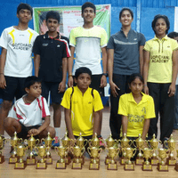
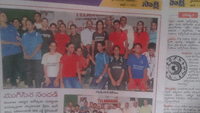
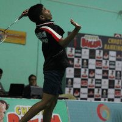
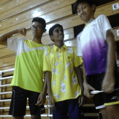

Hi hi, I'm Abhiram, but I also go by Abhi or *Ah-bee* (it's not the exact pronunciation but it's close enough and more accessible for my international friends). I'm a software developer by trade. What kind? Well, if I had to pick a niche, I'd say a [product engineer](https://posthog.com/blog/what-is-a-product-engineer). Currently, I'm working at [Sportskeeda](https://www.sportskeeda.com/).

## Programming

__START_PARA_WITH_SIDE_SECTION__

Tangentially, on the topic of craft, I consider myself to be a programmer and I love building quirky and/or meticulously crafted web UIs. At the time of writing, I occasionally find myself gravitating towards compilers and functional programming, so I'm trying to dedicate time to understand them better.

__START_SECTION_HEADING__
FP & Compilers
__END_SECTION_HEADING__

__START_SECTION_LIST__
- [SICP](https://github.com/nrabhiram/sicp-exercises) - A collection of my solutions for exercises in this textbook, written in Racket
- [Monkey](https://github.com/nrabhiram/monkey) - My (WIP) implementation of the Monkey language, as seen in the book, *Writing an Interpreter in Go*
__END_SECTION_LIST__

Previously, I had a *game-dev* phase, during which I learned to use Unreal Engine for developing games, designing environments, and creating cinematic sequences. Attempting to build a full-blown Soulslike game greatly influenced my relation with projects and how I manage them.

__START_SIDE_SECTION_HEADING__
Notable work
__END_SIDE_SECTION_HEADING__

__START_SIDE_SECTION_LIST__
- [Sapphire](https://github.com/nrabhiram/sapphire) - A bespoke site generator powered by Markdown content, written in Go and Svelte
- Early contributor @ [Castmoney](https://devfolio.co/projects/castmoney-feed-cc53) - A social De-fi explorer for Farcaster, winner at the [Based India 2024](https://based-india.devfolio.co/overview) hackathon
- [Kaamkar](https://github.com/nrabhiram/kaamkar) - A drag-and-drop kanban board for small projects, written in vanilla TS
- [Infinite Blades](https://x.com/infiniteb42) - Soulslike built with Veekay, partnered with [ReadyPlayerMe](https://readyplayer.me/), received investor commitments, scrapped due to creative dissatisfaction. [Devlog playlist](https://youtube.com/playlist?list=PL-CCDBQjv4OsSQDF46JCaxsxXFZ7tqL7r&si=ia84OkEh2kdr38Qx) here.
- [Reality Marble](https://youtu.be/g7WdED8W0-0) - My rendition of [Archer's Unlimited Blade Works](https://typemoon.fandom.com/wiki/Unlimited_Blade_Works), made with Unreal
- [Cinematics & environment art](https://youtube.com/playlist?list=PLHB0fdOUMX-3BFOQxV1vJPTAW4OsNEk5j&si=xT3k8pCyasEOUP9o) - A bunch of stuff I made while learning how to design scenes in Unreal
__END_SIDE_SECTION_LIST__
__END_PARA_WITH_SIDE_SECTION__

## Badminton
__START_PARA_WITH_SIDE_SECTION__

In a past life, I was a professional badminton player. Yes, you heard that right. Yes, I know I don't look like I was ever an athlete. Thanks for that, you weren't hurtful at all. Let me take a look at my highlights so that I feel better.

__START_IMAGE_GRID__

__END_IMAGE_GRID__

__START_SIDE_SECTION_HEADING__
Badminton Highlights
__END_SIDE_SECTION_HEADING__

__START_SIDE_SECTION_LIST__
- **Telangana State Championships BSU15** - 2nd runner-up
- **Innagural Telangana State Formation Championships BSU15** - Winner (look Maa, I made it to the news)
- **National rank in BSU15** - Top 10
- **Best finish in a national tournament campaign** - QF exit in BDU15, beat a pair ranked in the top 3 on the way
- **International outings** - Represented India in the *Jaya Raya Youth International* held in Jakarta, Indonesia. Participated in the *Chinese Swimming Club Invitational* series in Singapore
- **Inter University South Zone** - I was part of a stacked roster after a grueling selection process. It's a team event, I was a reserve, and we lost in the round of 16. We had players who were nationally active, and also climbing up in the world rankings. So, we were bummed about the result.
__END_SIDE_SECTION_LIST__
__END_PARA_WITH_SIDE_SECTION__

Wh-what's that? Did I do well in Jakarta? No, I got walloped. Anyway, after the 10th grade, I quit playing badminton professionally. I had promised myself and my family that I'd pursue this career further only if I break into the top 4 in the country. I didn't, so, I decided to focus on my education instead. I think I still have a good relation with the sport. I consider myself to be a badminton hobbyist. I try to play around 3-4 times a week and I occasionally meet with my team from college to play and catch up.

## Interests

What do I like to do outside of work, programming, or badminton? I don't know, why are you such a busybody? N-no, you misheard me, I said that you seem like a busy person so I didn't want to waste your time talking about my hobbies. But it looks like you've got nowhere else to be, so here you go.

### Music

__START_PARA_WITH_SIDE_SECTION__
I think the kind of music I like is quite bland, but I'm trying to venture out and explore music that's outside of my taste palette. I'm mostly into hip-hop. Huh? Who could have guessed? Why do you sound sarcastic? Urghhh, where was I? Oh yes, especially back in 12th grade, I was obsessed with the lore surrounding a creator more than their discography itself.

Listening to an album from start to finish is something that I'd never done before. It's really cool that some artists weave stories and experiences throughout their albums, but I'd never bothered to try. However, I'm making it a point to try new things. So, I decided to have a crack at it!

__START_SECTION_HEADING__
Albums I'm listening to
__END_SECTION_HEADING__

__START_SECTION_LIST__
- Saturation Trilogy by Brockhampton
__END_SECTION_LIST__

__START_SIDE_SECTION_HEADING__
Hiphop Lore Tidbits
__END_SIDE_SECTION_HEADING__

__START_SIDE_SECTION_LIST__
- Did you know that [Merlin from Brockhampton was studying to be an architect](https://youtu.be/pDaFOSUxqrY?si=udrC4wCmsi6TwxMq)?
- Or that [Lupe Fiasco](https://arts.mit.edu/people/lupe-fiasco/) taught a [course in MIT on rap theory](https://cmsw.mit.edu/video-lupe-fiasco-presents-rap-theory-practice-an-introduction/)?
- Oh wait, how about this one? [Mac Miller (RIP) and Vince Staples were really good friends](https://youtu.be/jxoFX81v-60?si=10vWQxqVAtqrhjJ7). Mac produced the entirety of one of [Vince's earliest mixtapes](https://soundcloud.com/blacksmith-a-g/sets/stolen-youth), taught him more about music, brought him out on tours, and was super supportive of him during his come-up.
- Mac's also made [appearances on Loiter Squad](https://youtu.be/D3CEbe3Xm-Q?si=cUcRahPMzW0XV3Vr), a show created by Odd Future.
- Speaking of Odd Future, did you know that [Lionel went on to act in The Bear](https://www.imdb.com/name/nm5152633/?ref_=ttfc_fcr_cst_4)?
__END_SIDE_SECTION_LIST__
__END_PARA_WITH_SIDE_SECTION__

### Movies

__START_PARA_WITH_SIDE_SECTION__
This is a newfound hobby. I'm a homebody, but I tend to get bored sometimes. So, to switch things up, I now visit the theater if there's something playing that I find interesting. As a fun activity, I make a mental note of things I like or dislike about both the theater and home watching experience. Usually, I get my sister or a friend to accompany me. But, nowadays, I try to go alone sometimes, which is something I'd never done for the first 24 years of my life!

__START_SECTION_HEADING__
Theatre solo watch list
__END_SECTION_HEADING__

__START_SECTION_LIST__
- **Sinners** - This was a rewatch. I had missed the opening sequence the first time. Unfortunately, I watched it in 4DX. I was prepared for incoming jumpscares but not the turbulence! This was my first horror, and second vampire film (after *Twilight*, I know, don't judge). I never imagined that I'd be intrigued by vampire fiction.
- **Mission Impossible: The Final Reckoning** - This movie is what I imagine Michael Scott's (from *The Office*) "Threat Level Midnight" would look like if he had access to a Hollywood-level budget.
__END_SECTION_LIST__

__START_SIDE_SECTION_HEADING__
All-time favourite movies
__END_SIDE_SECTION_HEADING__

__START_SIDE_SECTION_LIST__
- **Spider-Man: Across the Spider-Verse** - I loved how each character and their respective worlds had unique art styles. The film was fast-paced, and each scene was dense with information; there were so many things to look at in each frame!
- **Surf's Up** - This movie is just so memorable to me. So many iconic characters and scenes. It's a heart warming story, and I highly recommend watching it.
- **Gamyam** - This is a Telugu film that I watched as a kid. I can't tell if there's nostalgia at play, and whether I'd like it just as much if I watched it today, but I thought it was really well made back then.
- **Karthik Calling Karthik** - Underrated thriller film, great soundtrack, and a really unique setting. I remember my mom and I being on edge the entire time we watched it.
__END_SIDE_SECTION_LIST__
__END_PARA_WITH_SIDE_SECTION__

### Video Games

__START_PARA_WITH_SIDE_SECTION__
My first (and only) console was a Gameboy Advanced. As a pesky 5 yo, I bawled my eyes out dedicatedly everyday until my parents finally were fed up and caved in. My older cousins had one, and I used to be supremely jealous of them every time I visited them. Once I got my own, they kindly gifted me some of their older catridges. And that's how I became fascinated with RPGs. It's been ages since I last touched a multiplayer game, but I did have an MMORPG phase from ages 10 to 13. I used to play a lot of *Adventure Quest Worlds*, and occasionally a bit of *Runescape* and *Fiesta*, because my friends preferred them.

The first game that drew me to RPGs was *Legacy of Goku II*. I was mesmerized by the Cell Saga, and being able to re-live it through this game brought me immense joy. I'm enamoured by games with a high fantasy backdrop. And that's how I eventually came across the *Soulsborne* series. I've not played any of them yet, but I've played an indie *Soulslike* title before.

Shortly after, probably while watching Dark Souls lore videos, I caught the *Metroidvania* fever. Metroidvania is a subgenre of RPGs that was spearheaded by 2 games that launched way back, called *Metroid* and *Castlevania*. Metroidvania games evoke a sense of overwhelm and void; you're stuck in a vast world that you know nothing about. They encourage you to let your curiosity guide you. The world usually branches out a lot, and if you have accquired the necessary locomotive skills (that sometimes shadow as supplementary combat techniques) to reach certain corners, ex. a double jump, a lot of these branches suddenly become accessible. It's euphoric when you magically appear back at an area that you were struggling with a few days ago, after walking through an entrance. The realization that the world loops upon itself, breezing through enemies that previously gave you such a tough time, understanding the biome of the universe you've inhabited, the conflict and politics. This explosion of information, it's magical.

In the future, I hope to explore the *Roguelike* genre. Hades seems interesting to me!

__START_SIDE_SECTION_HEADING__
Top game recs
__END_SIDE_SECTION_HEADING__

__START_SIDE_SECTION_LIST__
- **Hollow Knight** - My first Metroidvania game. Greenpath was my favorite area, although it's one of the earliest. My favourite boss was Soul Master. It took countless attempts to understand its moveset and get into the right rhythm. I got stuck in the White Palace, lost steam, and never got back to it. Someday though!
- **Legacy of Goku II** - One of the best GBA games in my opinion. The feedback loop when you're in Super Mode (not using the term Super Saiyan on account of Piccolo being playable) pulls you into a trance. Fight mobs and collect the energy orbs they drop so that you can replenish your mana that's being depleted by your elevated state. Combat requires deftness, because the impact from an attack pushes characters back, but also makes them bounce off walls. You need to time and switch direction to continue chaining attacks. They do a great job at weaving a coherent narrative with both filler and cannon content. My favourite boss fight is *Piccolo Vs Android 17*.
- **Aria of Sorrow** - My first Castlevania game. I didn't know that they released games on the GBA. Over the course of 2 runs, I've unlocked the neutral, good, and bad endings. I've explored 100% of the map, and I'm trying to farm for all of the enemy souls so that I can unlock the secret ending. I tried playing the special game mode with Julius as the playable character. However, I'm stuck at the final boss fight. I suck at this game, and my excuse is that I played it on an emulator. It's really hard to press the buttons without looking since they're not raised, okay? I just tanked my way through enemy attacks and stockpiled potions.
- **Mortal Shell** - My first Soulslike. This is an indie game, and it's shorter than most of its counterparts, but the lore and worldbuilding is rich. The build system is interesting, both narratively and in terms of mechanics! You can switch between the vessels of a few warriors. Each one possesses unique weapons and abilities.
__END_SIDE_SECTION_LIST__
__END_PARA_WITH_SIDE_SECTION__

### Books

There are plenty of books that I like the idea of having read, but I've not gotten to, mainly because I'm feeling unmotivated and lazy. I end up collecting them and I tell myself that I'll get to them eventually, thus forming an **anti-library**. My mom thinks I'm wasteful. What's that? You think she's right? Alright, damn, give me a break! Regardless, I still think it's cool to have a bunch of books lying around that you could pick up if you're feeling inspired or curious enough.

I'm mostly into high fantasy and slice of life stories, but I'm keen on exploring the vampire fiction and sci-fi genres further.

### Anime and Manga

My introduction to anime was back in kindergarten, when Dragon Ball Z used to play on TV. I was so engrossed in the show and its characters, that a friend and I would meet up every evening to make some progress in LOG2. If memory serves me well, as an alternative to Budokai Tenkaichi (we didn't have access to a console on which we could play it), we briefly ran a DBZ fight club in our apartment's corridor; you could pick your character before engaging in combat. I'm already embarrassed, enough with the judgey stares. 

I don't consume this form of content as often anymore, but I used to voraciously from ages 17 - 22.

Duel Masters, Mob Psycho 100, Naruto, Hunter X Hunter, Gintama, Code Geass, the Fate Series, Campfire Cooking in Another World, Berserk, Koe No Katachi, The Disastrous Life of Saiki K., Angel Beats, Megalo Box, Hajime No Ippo, Haikyuu, FMAB, Yuri on Ice, MHA, and Tokyo Ghoul are some that I enjoyed thoroughly and have fond memories of.

You don't think the DBZ fight club incident is true? Like I said, it happened way back in kindergarten because I was bored out of my mind and my memory of it is foggy! I'm going to start ignoring you and your little comments. Now get out of here!

## Contact

Oh you want to keep in touch? Huh, that's amusing. Well, I'm most active on [Farcaster](https://farcaster.xyz/vaxitas.eth). Otherwise, you could try my <a href="mailto:vaxitasxyz@gmail.com" target="_blank">email</a>.