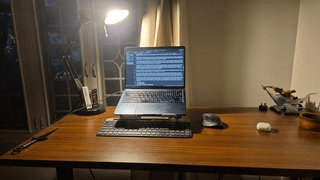
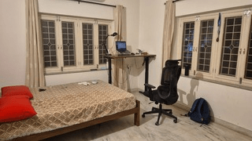
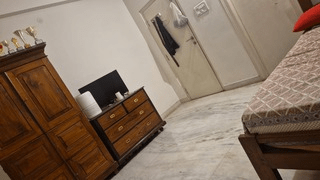

My current work commitment endows me with the luxury to work remote. So, I made the decision to move back home and live with my family in HYD about a year and a half ago. I was excited about the move, because it was the first time in over a decade that my family would be living together under the same roof. When I turned 13, we relocated from Singapore to look after my paternal grandparents. Their health was deteriorating and they were in need of caretakers. There aren't a lot of opportunities in my father's line of work here, so he stayed back and took on roles that provided him the flexibility to visit us frequently. Last year, he finally retired and moved back permanently.

In contrast, I was saddened about leaving BLR after having lived there for over a year. I got a taste of what it's like to have supportive friends and peers who are invested in your life. We lived in close proximity to one another, and we would spend the nights in one another's apartments. This was something that I cherished, and I was concerned that we might drift apart, given the distance that had abruptly come between us. So, I decided that I would visit them frequently.

Life at home is amazing; my parents are in great health, my sister's driven and is making progress at building the kind of life she wants for herself, I enjoy my work, and I get to spend more time with Siri! Despite these perks, I had been struggling with a major slump on other fronts.

## Am I a Ghost?

Suddenly, I was plopped back into my old room, which had now usurped the roles of both my workspace and personal space. I appreciated being able to work from the comfort of my home. However, the line between work and the rest of my life was blurred. And it worsened day by day. It didn't help that I lacked even a modicum of what could be considered a personal life in this city. My childhood friends had left and my hubris had led me to believe that most of the folks here were vapid.

For the first few months, I was unfettered by the challenges I was facing at home. At the time, I was working on a project with one of my closest friends. He got me on board when I was taking a brief hiatus from professional commitments. I absolutely enjoyed collaborating with him. It also helped my self-esteem immensely. I felt more confident about my competence and my ability to see projects through. After moving back home, I would spend most of my nights and weekends on this. We would catch up with each other often and it felt nice to speak in the same language, with regards to the project and in general. I'm proud of the fact that we never let disagreements about the project affect our relationship outside of it. But, after a few months of relentless toiling, I was running low on fuel. I couldn't bring myself to care about it any longer. I informed him of my current state of mind, and that I wanted to drop out.

With that, I lost what seemed like the only thread that connected me to my friends back in BLR. I hoped that we could still be in touch, but the project was so demanding that he was completely immersed in it. Soon, I began to feel left behind and had no one in my corner. I would think about them daily and yearn for their company, but I was a phantom in their lives, and I was unsure if there was anything that I could do to change it.

## The Silence

I spent a lot of time in solitude. There were days when I wouldn't leave my room, let alone the house. I had plenty of time to myself, but no one to share it with. On the rare occasions that I did spend time with my friends, every tiny interaction held a lot more weight in my mind. I would scrutinize and analyze them for hidden intent. Are they scornful about my work? Why don't they check up on me? Did I get stood up? Do my friends think I'm boring? Do they dislike having me around?

I began to implode and explode at others, and my family faced the brunt of it. I was upset with them because they weren't empathetic of my (somewhat self-inflicted) circumstances and felt misunderstood. I failed to notice it, but I imagine that they felt equally hurt by my behaviour. I was cooped up in my room most of the time, and my patience with them ran very thin. This in turn alienated me further from them.

Now that I wasn't as occupied as before, I found it challenging to fall asleep at night. Usually, this doesn't pose much of a problem. Wherever I go, I've effortlessly found groups that play badminton regularly. It's the only form of physical exertion that I'm consistent with. But, my badminton friends here exist in fragmented and disjointed circles. Some of them live in opposite ends of the city. Some still play professionally, so they don't have the time to play for leisure. A few are in college and can only make it during their vacations. Others are simply too occupied (or lazy) to get up in the morning and travel for a game. Usually, when I'm playing regularly, I'm so exhausted by the time night comes around, that I fall asleep the moment my head hits the bed. Unfortunately, the night was when the isolation would hit me the hardest. I distracted myself by giving in to my gluttonous tendencies. I used to snack a lot late in the night, and that messed with my sleep, metabolism, and headspace even further.

I wallowed in my plight for months. It led to a vicious cycle and began affecting things that I valued. I constantly felt bloated and gassy because of the overeating. I jeopardized my relationships with those who were willing to be there in my life. I started loathing myself and viewing myself poorly. 

## Realizations

Eventually, I had a couple of realizations. Firstly, it's a good thing that my friends are occupied. They have things that are important to them that they look forward to every day. Secondly, it's possible that these instances that were bothering me were circumstantial and I was viewing them in isolation. It seemed pointless to mull over them for so long. Either way, others not having time for me is something that's out of my control. The possibility that I'm peripheral to them is deeply upsetting. But, dwelling on it made me feel worse.

I really wished that we could continue being a part of one another's lives. Instead of taking things personally, I decided to have a discussion about how the uncertainty of where I stood with them was bothering me. Regardless of how that would play out, I figured that I ought to explore and discover activities that I enjoyed. But, this implied that I shouldn't be rigid and I should be open to trying things that are outside of my comfort zone. I devised a motto for how I wanted to approach this problem. 

> What is something that I would never do? What is something that I can do that is off-brand? 

This felt more playful in nature to me, and it eased me into the idea of rearranging and replacing things in my life to fit my liking.

Gradually, I came up with a list that I could start experimenting with.

- Watch movies in the theater more often, perhaps even go alone
- Listen to a music album from end to end
- Start an official badminton pickup group and tenaciously convince my friends to join me
- Call or write to my friends whenever something reminds me of them
- Attend niche clubs and meetups
- Organize a house party

There was one item on the list that I dreaded the most: revamping my room.

## Nemesis

I spend most of my time in my room. I use it for work, leisure, and rest. But, I've never used it this extensively before. During college, I shifted to another room[^1], as mine had been morphed into a makeshift nursing room for my grandfather, who was struggling with Parkinson's and other diseases that accompanied old age. A couple of years after that, he passed away (peacefully) in that very room. It felt like it was engulfed in gloom. The other concerns marred my perception of it further.

The thick canopy of trees that surrounded our house barely let any light seep into my room. It was worse in the corner where my desk lay. The height difference between the bottom of my desk and my seat made it difficult for me to pull the hard wooden chair out from underneath. I would constantly slouch while at my desk because my screen wasn't at eye-level. Once, I ended up with a neck sprain so bad, I had to take the day off. My bed was placed smack in the middle of the room, and on the other end was the drying rack, on which everyone at home hung their towels. The closets and cabinets were filled with stuff that didn't belong to me. I would constantly lose my belongings in them and they'd magically reappear in another location. 

My room felt very cramped, and it frustrated me that it was treated as a dumping ground. My mom's a great designer. She virtually built our entire house and handled all of the planning, right from the architecture to the interiors. Living at home is serene and the place is filled with all sorts of trees and animals that come to rest. Guests and passersby alike are mesmerized. But, my mom is also a stickler for cleanliness. She has systems already in place at home and they work well for all of us. I'd always been fine with silently reaping the rewards of it. But, it started to upset me that I had little control over my relationship with my room, considering I was spending the most time within it. Instead of eliciting joy, my room would envelope me in despair and leave me fuming.

I had conversations with my family about this. I assured my mom that I'll take responsibility for the organization of my room. During the negotiations, she suggested moving my workbench to another corridor in our house; one which was brightly lit in the day. But, I was adamant on setting up my desk in my own room. I wanted my room to be a warm and cozy corner within the house that I could recede to, a place that inspired me, and somewhere I could focus without interruptions. This seemed reasonable and possible to me. Walking around the house for each of my requirements seemed unnecessary and inconvenient. My mom wasn't convinced and was reluctant initially. She felt that my room would become cramped. She eventually caved in and gave me the go-ahead. Now, I think she is impressed with what we've done with it.

## The Revamp

I started solving some of my more minor inconveniences way before I talked about my plans to revamp the room with my family. For instance, I despised the blue light the bulbs in my room would emit. Especially at night, it was very distracting and made it difficult for me to pay attention to what I was doing. My sister was planning to buy a new one, so she kindly gave me her old desk lamp. This was a godsend. The yellow light was a lot softer on my eyes and it only illuminated the corner my desk was in. Way later, my dad helped replace the tubelights in my room (for the same reason).

### My Closet Was a Neat Mess

I remember spending an entire weekend reorganizing the clothes in my closet into neat piles. It's not as though they weren't organized before. Pulling clothes to wear for simple everyday use at home or even to go play proved to be an inordinate task for me. It felt like I was playing Jenga. The clothes that I would use most often were almost always buried underneath a stack of freshly ironed ones. No matter how careful I tried to be, I would end up wrinkling them. After a point, I was fed up with this. This didn't have to be so grueling. It was a terrible start to the day and I have a suspicion that trivial rituals such as these can set the tone for the rest of my waking hours. Reorganizing my closet was of utmost importance.

Back when I lived in BLR, I had a system that felt more intuitive to me. My mom wasn't keen on foregoing hers as it meant that I would have to handle my laundry. I have a hunch that it's because she didn't trust me with any of the appliances at home. However, this didn't require much convincing as these were little chores she expected me to pick up since I'm around the house more. So, from then on, I handled my laundry, drying my clothes, and placing them back in my closet. I organized them broadly into 3 categories: sportswear, homewear, and the good clothes; i.e. the ones I wear when I'm going out. Next, I subcategorized them into articles of clothing. While implementing this, I faced a minor hiccup. Although this made it easier to navigate the shelves in my closet, it took up a lot more space. I realized that I had too many clothes that were rarely used in recent times.

After a lot of deliberation, I discarded the older clothes that I was certain I wouldn't use again. Mind you, I'm the least bothered person about apparel. I've been wearing the same clothes for nearly a decade. Some of these items brought back fond memories. This made it challenging to decide which ones to let go of. We donated most of them and repurposed the remaining ones as cleaning apparatus for the countertop.

### Transforming My Desk Into a Workbench

Now, I could finally direct my attention to the elephant in the room — my spartan desk and the damn chair that screeched so loudly every time I got out of it. I must have spent hours soothing myself lest I smash it into the ground. The changes to my lighting arrangement definitely elevated the experience of sitting at my bench. But, it still didn't feel quite like a workbench. Laying on my bed in weird positions (that might have adverse effects on my spine and nervous system in the future), while propping my head up against the back of the bed frame seemed more enticing for working purposes. It was also a surefire way to fall into a deep slumber. I wanted to ensure that I would never bring my work to my bed. For the sake of this delineation, I decided that it was worth buying new apparatus that met my needs.

This didn't seem like a splurge to me. My workbench is akin to a tool that I wield, very much like the racquet and shoes I use while playing. The size of the grip and distribution of weight matters because my racquet should feel like an extension of my arm. My shoes should plant my feet firmly to the ground even when I pivot violently around my ankles so that I can prevent injuring my legs, the most important part of my body when it comes to this sport. Similarly, my workbench should support the headspace I want to be in when I'm working. I want to be able to focus at will. If I'm doing something that is creative in nature, I want it to provide the ventilation required for letting ideas flow. The upside to investing in a workbench that encourages good form, both physically and metaphorically, seemed massive.

I created a list of parts I needed to shop for. First, I bought myself a laptop stand. It felt amazing to be able to adjust the height and angle of my laptop's elevation as I pleased. Then, I bought myself a keyboard and mouse. I don't hold strong opinions (yet) about these items. So, I just got the most economical keyboard. My sister recommended a specific ergonomic mouse. Apparently they prevent muscle strains and annoying things like carpal tunnel syndrome. I'm fearful of a future in which I can't use my hands as I intend to. That's a future in which I can no longer play this sport that I've come to adore. So, I blindly heeded her word. Then, I got an ergonomic office chair. I didn't care much for this either. I just wanted something that didn't numb my bum. We found a chair that had a limited duration sale offering, so I went ahead with that. Now, all that remained was a replacement for my desk.

It seemed smart to invest in a standing desk with adjustable heights. I was afraid that I was falling into a sedentary lifestyle. This could lead to irreparable damage: weight gain, sciatica, and other spooky things. I had a couple of minor health scares that reaffirmed my fear that these were possible eventualities. I wanted to get into the habit of standing up while working, considering that I sit for long hours at my bench. I found a model that was economical and also had great reviews. It was motor-controlled and DIY. My dad and I assembled it together. But, before that, we had to move my old desk into another room. We stood at either end of it, and lifted it up. It's hard to get a grip on the table from underneath its base, so we latched our fingers in between the small gap between its drawers and stocky frame. The pressure on our hands was immensely painful, but it was all worth it after we put the new desk together.

### Rearrangements

The table is significantly wider than my previous one. It loomed over the edge of my bed, which was in the middle of the room. My family was brainstorming on whether we should move the desk elsewhere. I vetoed this the moment I heard murmurs of it. I had grown quite fond of this corner. Although it's dark, the new lighting arrangements more than made up for it. That was when my dad had the genius idea of moving my bed to the corner opposite my desk. Suddenly, my room had expanded. There was so much more space to walk around. However, there were a couple of minor drawbacks. You would have to climb on the bed to access one of the window sills and walls. This made drawing the curtains and dusting the corners tough. But the increase in space was worth the hassle.

__START_IMAGE_GRID__

__END_IMAGE_GRID__

## Redefining Projects and Relationships

My room was finally in a desirable state. I was drawn towards it, and it made my family feel welcomed. They would come in occasionally to simply sit or chat with me. I was elated that I was capable of designing a space that accommodated not just me, but others that I cared about. My concerns of being alienated from my family were unfounded. I was brimming with inspiration and I had ideas on how I could make use of the space that opened up. I wanted to get a bookshelf for my "antilibrary". I could whimsically pick up whichever one I felt like reading in the moment. I also hoped that it would encourage my friends to visit me and borrow books that they like. I considered getting beanbags and a console for playthrough sessions of my favourite RPGs. I wondered if I should place some figurines on my spacious desk. My mom nipped this in the bud by pointing out that I might be acting in haste. The freed up space in my room is a good thing, and it feels full of potential. But, if I start filling it with things, I'll have the same problem on my hands that I had set out to solve initially. That sounded valid.

I'm aware of the platitude that cleaning your room helps you get your life in order. But, thinking more deeply about what I want from my room and designing the space has had a positive effect on me. It led to a virtuous cycle. I didn't feel like I was spiraling as often anymore. I was shaping the environment around me, and in turn, it was shaping me. This altered the way I view and approach projects and relationships. 

Starting and being engaged in projects is a recent phenomenon for me. In the past, most of my undertakings were strongly correlated to what I did for work. My self-worth was attached to the outcomes of these projects. Unbeknownst to me, I had raised the stakes and the cost of failure seemed massive. But, projects can serve different purposes: making new friends, finding hobbies, tearing down old habits so that they can be replaced with more meaningful ones, quenching your curiosity, and so on. A project not being tied to your craft does not diminish the value or meaning it holds for you. This was something I internalized over the course of revamping my room. Funnily enough, it dawned on me much later, that my quest to redefine my relation with my room is also a project. It's at a stage where I can reap the benefits of the work I put into it, but it's far from finished. Projects don't need to be finished. Your projects can have spawns of their own. 

This approach was liberating. I enjoy the things I do a lot more now. I'm terrible at most of my endeavours, but it's fun to suck at an activity, and see yourself getting better at it over time. A project can sometimes almost feel like a living thing; something that breathes life into you the same way you breathe life into it. Redefining my relationship with my room felt the same way. I'm so grateful for it. We've been through so many things since I was a kid, and I've not treated it fairly in the recent past. Despite that, it still provided me an opportunity to collaborate with my family and work on reshaping it. In the cab ride on the way to the airport, after leaving our apartment in Singapore for the last time, I remember my family being upset. They were on the verge of tears and I remember thinking how absurd it was that they were mourning an inanimate object. I would like to think that this collaboration has helped me strengthen both my understanding and bond with my family.

I've been starting to feel a lot more adventurous lately. With this newfound perspective, I started doing things that would have felt daunting in the past. Playing early in the morning is an uplifting ritual and I was beginning to miss it. I set out on a search for people who might be interested in forming a pickup group. For the uninitiated, a pickup group comprises of a bunch of folks who like playing a sport. Usually, they come from diverse walks of life, but they share a passion for the sport. One of us organizes a game, and whoever's free joins in. We split the costs for travel (if we're carpooling), shuttles, and court fees. It was a stroke of luck that an old acquaintance reached out to me, when I was still struggling to find people. He was attempting to do something similar, and he asked if I'd like to join. Initially, the turnout was low. But, over time, we pulled off a miracle by tapping into my fragmented groups of badminton friends, and convincing them to come and play with us regularly. A few of them had some gripes. But, the games were so intense and the members were so friendly and welcoming, that people were fine travelling long distances to come and play with us.

I've been feeling very isolated and overwhelmed on the internet. Being online is a huge part of my life. But, it felt daunting to expose myself in front of the rest of the world. On the other hand, there were a lot of cool people whom I adored who spent a lot of time there. I decided to make myself a small room, my online workbench, so that I have a place to recede to in this vast network. And when I've mustered the courage, I can leave the comfort of my corner to knock on their doors! As I created my site, it spawned a couple of other offshoot projects. A site generator that supports the way I think about ideas and want to write about them, and a UI library of interesting components that I tend to reuse across projects. Even within the realm of the site, I'm trying to explore my relation with writing, and I see that spawning more projects in the future. I would like to write introspective essays, reviews that analyze some of my favourite games, books, and movies, monthly updates for shareholders in my life, and things I'm exploring craft-wise. But, I'd also like to be able to write about a topic whimsically. I want this space to allow me to share my random streams of consciousness as well and I want to explore how I can make that possible for myself.

I no longer grimace at the thought of not completing my projects. And I'm fine with my projects taking time. Most meaningful things in my life have withstood the test of time and have braved through stormy weathers with me; be it projects, hobbies, or relationships. I'm glad that I'm a lot more patient with these things, and that I've begun to find collaborators who feel the same way. I hope to find more such things that excite me everyday, and even more such friends and collaborators with whom I can spend time and in turn explore a language that is peculiar to us!

---

*This essay was written from a prompt in the [IndieWebClub Meetup, Bangalore](https://underline.center/c/indiewebclub/10).*

> Tell us about your physical creative space and how it affects your work.

## Backmatter

[^1]: I lived on campus, but I used this other room whenever I'd visit.