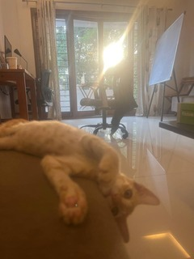

- I went to a Crocs outlet to buy slippers for home wear. The straps on my older pair broke.
- My cousin sister visited us during her summer break. She had completed her 10th grade exams.
- My cousin and I watched a couple of movies in the theatre: *Alappuzha Gymkhana* and *Dog Man*. This was my first Malayalam movie in the theatres and my first 4DX experience respectively. My sister particularly enjoyed the former.
- For the first couple of weeks this month, I didn't play as often. My friends were occupied with work and we couldn't agree on a date. 
- I succeeded in persuading them to join me for a session once. There were 3 of us, so we took turns to play singles. 
- Towards the end of the session, my friend caught a back spasm. It started swelling up, so we cut the session short. 
- Later, he consulted with a doctor. We were relieved it wasn't serious, though it confirmed our suspicions about the cause. He didn't ease into the physical demands of playing a game after weeks of inactivity.
- As we were leaving, my friends jokingly suggested that I buy a second-hand car instead of travelling by cab. I could get a premium car for dirt cheap. I pointed out that I'm a homebody, and I rarely step out of the house. It seemed like a waste of money. They cleverly retorted by volunteering to drive me around if I get a second-hand BMW or Audi.
- That same day, in the afternoon, I accompanied my mom and cousin to Luna. I hoarded some books as I felt my mom's disapproving gaze bore into my back.
- I left for BLR that night. My family and cousin were to follow the week after. We were bringing Siri along for our family trip and our vehicle would have been cramped with the 6 of us. That's why I left earlier.
- I attended the [Zig India Meetup](https://zigindia.org/) my first day in BLR. They discussed overflow exploits and [MLIR](https://mlir.llvm.org/). I felt out of my depth but I'm trying to explore making compilers in my free time. Meeting folks with similar interests seemed like a good idea.
- My first week in BLR, I played everyday. I was familiar with the organizer and some of the members in the group from back when I used to live there.
- I met my coworker, Shashank, for the first time after working together for over a year. He recently shifted to the city. The ride from my uncle's to his place was painstakingly long, but it was worth it! We finished work, caught up, and had dinner together. I'm proud of the fact that I hooked him on to Calfornia Burrito.
- I also met Varun for dinner one day. We caught up and I conveyed my condolences for Biryani's[^1] passing. We talked about what we were working on at the time, the games we were trying out, and what was up with our lives in general.
- Sunday morning, I met Preet and [Abhishek](https://abhi.studio/) at Cubbon. I went to the park with my mom, cousin, grandfather, and Siri. While I was waiting for them, Siri made an acquaintance with another dog called Majnu. He was so cute, obedient and well-behaved. He wanted to play with Siri badly, but she didn't cooperate. I took a stroll with Preet and Abhishek. Then, I headed back home with my family.
- In the evening, I went to [Pizza 4 P's](https://pizza4ps.com/in) with my sisters and mom. My sister had booked our reservation a week in advance. Unfortunately, she couldn't find a table for the entire family.
- When we first arrived at the restaurant, it didn't make a strong impression on my mom from outside. But she enjoyed the experience once we were seated.
- The next day, we woke up early to travel to Coorg for our family vacation. We left in 2 separate vehicles. 
- We stopped in between to visit a temple. My dad was fascinated by the architecture. The verandah was cool although beams of sunlight scattered across it.
- We reached our homestay just in time for lunch. My family was disappointed with the place.
- Some of the complaints I remember are: there aren't any walls around the house to protect Siri from the wild dogs that were roaming around, the rooms aren't as spacious as in the pictures, the house is almost 30 minutes away from the town, and the place is dirty.
- I personally thought that the place was alright. It was secluded and quiet, but the scenery was nice. We also had TV and good network connectivity. I appreciated the change in pace and environment. It seemed like a great way to reset.
- But, no one nipped the concerns off and my family had begun to spiral. Begrudgingly, I suggested that they request a refund so that we could head back. It seemed pointless to stay there for half a week when all we were going to do was complain the whole day.
- After some back and forth, we came to an agreement with the owners regarding the refund. We left at noon the following day.
- On the way back, we stopped at the elephant reserve and a lake and a restaurant for lunch.
- I spent the rest of the week mostly playing badminton.
- I met another friend of mine a couple of times. They were in the city to attend their cousin's wedding. We watched Sinners together and grabbed lunch at Fatty Bao.
- I didn't leave with my family because car journeys make me nauseous. I left the next day. 
- My cousin's family dropped me off and bid me farewell. While we were waiting, my cousin asked if I had come across any other places to explore in HYD. I had mentioned to her that I wanted to find interesting places and challenge my preconception about HYD being a boring city.

## Backmatter

[^1]: Biryani's a little stray kitten that followed Varun and me up the elevator and into his apartment. We couldn't find his mother, one thing led to another, and they eventually decided to adopt him. He's usually mellow, but he could be very inquisitive and cheeky at times. I know because I've witnessed his *zoomies* first-hand, often late in the night. I'm abruptly awakened from my slumber by the incessant scratching of my shorts while he sits on my bum.

The reason for his name is also quite funny. Preet and Varun were discussing what they should do with the kitten when he first entered the house. Varun sarcastically suggested that they make cat biryani (they're both vegetarians). And the name just stuck. 

I would only see Biryani when I visited BLR, but I'm grateful for the time I spent with him. I'm deeply saddened by his passing. RIP. We'll miss him. I hope that Varun and Preet get through this tough time.