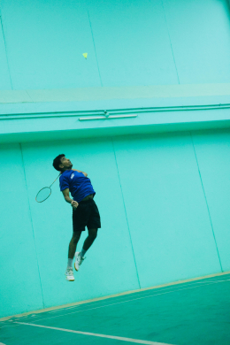
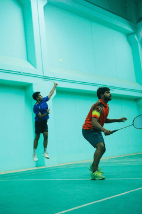
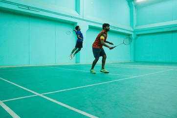
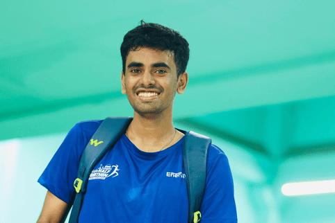
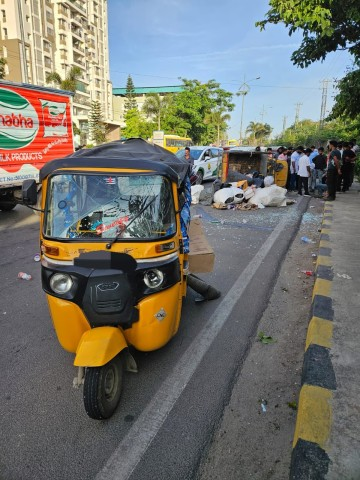
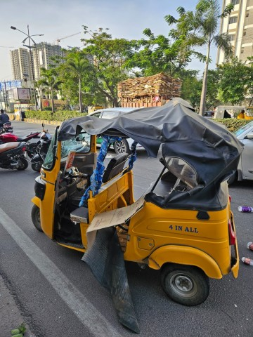
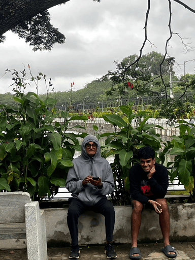
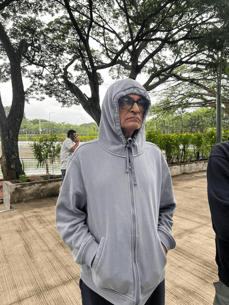
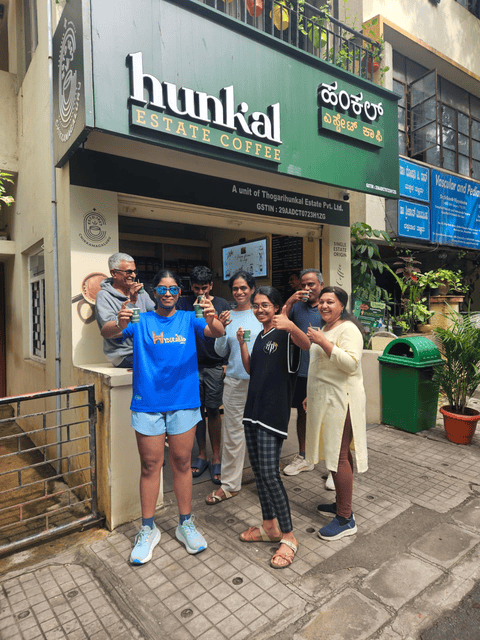

I always mean to write about the happenings in my life on a monthly basis, but my tendency to procrastinate gets the better of me. The past few months have been quite eventful, and I would like to reflect on them. For the sake of brevity, in this edition of the monthly log, I shall condense and present to you only my highlights from the past 3 months. Unfortunately, I'm still left with a lot to cover.

This seems like an appropriate juncture to issue a warning to my fellow readers. The degree of correctness and specificity might vary from event to event. As the sole chronicler, I write straight from the source. But, considering the corrosive nature of my memory, in conjunction with my tendency to exaggerate for dramatic effect, its reliability may be questioned.

## I Had a Visitor

**circa 1st week of June**

Sometime in early June, Abhilash[^1], a friend from BLR, traveled to HYD to catch up with his friends. He was around for 3-4 days, and luckily, his visit coincided with the weekend. We made plans to meet and I promised to take him to play with my new badminton pick-up group. On his first day here, he went out with his mates to Broadway, a brewery that I had recommended as a nice gathering spot in the city[^2].

The next day, I paid him a visit at his hotel. We grabbed (complimentary) breakfast together and talked about his current undertaking, a rooftop gym where you can practice strength and conditioning, wrestling, boxing, etc. I find this project cool, and I'm trying to provide what little help I can to get it off the ground by acting as a sounding board and creating a website for it.

On Saturday, he joined me for a game. Only 3 of us from the group showed up that day. So, we played doubles, rotating and switching partners after each set. Abhilash and I used to partner up a lot back when I lived in BLR, so we gel quite well on the court. We initially played on opposing teams and the games weren't too competitive. I think adapting to the conditions of a new hall had a huge part to play in this. The lights in the hall are blinding, especially at the edges of the court. The flight of the shuttle is peculiar too. It's slow on one end and fast on the other. I'm sure the change in weather and coordinating on court with strangers didn't help either. We paired up for the last couple of sets. Since we have a good understanding of each other, we coordinated well and those games were a lot closer.

## The Inception of Vaxitas

This site is the first personal project I've worked on in almost 2 years. I've been trying to redefine my relationship with projects. I think the way I viewed them previously had hindered my ability to derive joy from trying new things. I wrote about this in greater detail in a [personal essay I wrote in August](/blog/my-creative-space#redefining-projects-and-relationships), but I want to shed some light on the new mindset I've adopted for hacking on projects.

I would attach my self-worth to a project's status and when things got rough; I began to view myself poorly. This led to a vicious cycle in which I got overwhelmed, the element of play diminished, and I struggled to care about the project. I left in my wake a streak of unfinished projects, and it irked me that I didn't see them through. It was upsetting that I was doing such a bad job of keeping promises that I'd made to myself. This framing didn't help matters either. I am aware that I do my best work when I feel playful and explorative. So, I tweaked my approach in order to create the space for it.

I decided to tackle this train of thought by nipping it in the bud. Now, when this feeling looms, I say to myself "So what?". I'm unable to see a project through. So what? My interest in a project has fizzled out. So what? A side project I started now has its own spawn. So what? I'm trying to do the opposite of what is suggestive of my disposition. At the very least, this approach has prevented me from getting in my own way as often. I'm also curious about the effects that this will have over a longer timeframe. I want to see how far this strategy can take me. As of now, I no longer second guess myself and I feel a lot more enthusiastic (and a lot less overwhelmed) about working on projects.

I love working on my personal site. Writing, designing pages, and ideating on taxonomy are all things that excite me. But, I could feel the scope creeping in. I was determined to have something ready that I could share with my friends soon, and I had already spent enough time working on a site generator that met my requirements rather than making the site itself. To keep the procrastinator in me at bay and my motivation from waning any further, I fleshed out an exhaustive list of features and pages that I thought were absolutely essential for a v0 and worked towards striking them off. I figured that I could work on the other stuff iteratively afterwards as well.

## Naru in the Uru

**circa 2nd week of June**

That same Saturday night, I left for BLR because I wanted to catch up with Varun and Preet[^3]. They were immersed in their work on [Noice](https://noice.so/) and I hoped that their energy would rub off on me and ignite the burst of inspiration I needed to lift Vaxitas off the ground. The plan was to stay in BLR for a couple of weeks. The first week, I wanted to stay close to my friends so that I could accomplish my goals. So, instead of crashing at my uncle's place, I decided to stay in a hostel.

### Pandemonium

I reached at around 8am. Upon arrival, I left my luggage at the reception; check-in was at noon. The staff was kind enough to allow me to use the washrooms, so I cleaned up and headed to my friends' place, which was a couple of kilometres away. I'm not a huge fan of walking, but I had time to kill. They were still asleep when I reached, so I ordered some brekkie[^4], settled in, and began fleshing out some of the pages that I deemed important for **Vaxitas v0.0**.

Varun's entrance into the seating area startled me. He mentioned that they might have been in contact with a coworker who potentially contracted COVID. This sent me spiraling. I wasn't aware that people were falling sick in BLR. If I had known, I wouldn't have planned a trip at all. I ordered some masks, cancelled my stay in the hostel, and booked a hotel room so that I could isolate myself. As part of my due diligence, I informed my mother of my predicament. She found it odd that I wasn't aware of the surge in cases in BLR and I struggled to convey to her that my source of news, my Twitter feed, had failed to deliver this information.

Once I received the masks, Varun and I headed to *Rameshwaram* for brunch. I was still full from breakfast, so I just tagged along for some coffee. We had a chat about work, side projects, and hobbies. I shared with him my newfound interest in vampire fiction. I fawned over *Sinners* and my obsession with the *Castlevania* franchise; both the Netflix show and the game I was playing at the time, *Aria of Sorrow*. I also brought up my site and why I thought that it's one of the most important things I'd worked on for myself. Most of what I shared with him was a regurgitation of my more meditated-upon thoughts on the topic that I've written about [here](/about/vaxitas).

Afterwards, I gathered my belongings from the hostel, checked in at the hotel, and rested for a bit before heading back to their place. Calvin had a free basketball trial lesson at my regular badminton spot in BLR. They have outdoor spacing on the ground floor that is used for various sports. He asked if I'd like to tag along, but I took a rain check as I wanted to spend some time writing. After the trial lesson, the basketball court was repurposed for pickleball. He joined in for a game with a couple of strangers, and ended up exchanging numbers. Go Calvin!

### I Think I’m in Love With Bobba

That night, we decided to go out for dinner together. After what seemed like an eternity of contemplating, we landed on *Burma Burma*. The wait time there was quite long, so we decided to go to another place. We were halfway there when we got a call that a table had freed up. We slogged back, and on the way, we bumped into an associate — someone I had worked with at Castmoney.

I don't recall what we had for dinner. I remember that Varun ordered a dish that loosely resembled Malayali cuisine and most notably, I had boba. I don't remember the flavour, but it was definitely the chocolatey milk kind. I relished it, and it came as a mild surprise to me that I liked it. Bubble tea is really popular in Singapore, but I had never developed a liking for it. I have a suspicion that the excessive sweetness in the one that was prepared here must have appealed to the sugar fiend in me.

### Other Stuff I Did

I decided to cut my trip short by a week. My mom suggested returning the very next day, but I decided to stay put and complete what I set out to do before going back home. There's a (now fragmented) group of badminton regulars that I used to be a part of, back when I lived there. I went to play with a few of them a couple of times. The organizer was kind enough to accommodate me despite the short notice. I ended up meeting Pradyumna, a mate from the group, on one occasion, and Abhilash on another.

I mostly hung out at my friends' place. They were engrossed with their projects, so we didn't get to spend much time. I did accompany Calvin for a couple of walks; once to grab brunch and once on a coffee run. I haven't spent as much time with Calvin as I have with Varun, so it was nice that I got a chance to catch up with him. He's someone who takes immense pride in his work, so it was refreshing when we bonded over our attempts at picking up new hobbies, and accommodating them in our day-to-day lives.

### Isolationvania

The isolation got to me that week, and I didn't cope with it very well. A couple of days into my trip, I got myself tested. To my relief, I was in the clear. But, I still spent most of my time cooped up in the hotel room, lying on the bed. My friends were occupied anyway, and I had a clear goal that I wanted to accomplish. To subdue my boredom, I continued with my *Modern Family* binge-watching sessions. I had reached the 8th or 9th season. Rarely, I would whip out Taleb's book, *Fooled by Randomness*. These activities didn't alleviate the dullness, so I switched over to Netflix's *Castlevania* series.

I was also working on my 2nd playthrough of *Aria of Sorrow*. I think I had gotten 2 out of the 4 possible endings in my first run. I was adamant on unlocking all of them, and this required a lot of grinding and farming. It's definitely an interesting game. The *soul system* allows you to craft a plethora of builds that match your combat style. I appreciated the freedom it afforded me, but it was overkill at times. The platforming, although challenging, wasn't as brutal as Hollow Knight, the only other Metroidvania I had tried prior to this game. And that's why I wasn't fazed by it. Completing the game would have proven to be a lot more demanding if it didn't let you carry as many potions.

In this game, you play as Soma, a high schooler who unsuspectingly stumbles into Dracula's castle. This was my first introduction to the universe, so I was just as clueless as Soma. The show was interesting because it filled some of the gaps in my understanding. But, once it began deviating from the game's canon, it morphed into an uncomfortable watch. From the murmurs I've heard on subreddits, the show gets the motives of characters wrong, and as a result, the choices some of the characters make seem bizarre.

I only have *Alucard X Mitski* edits to thank for my impulse to watch this wretched show. I was looping her sad songs all day, and in hindsight, that didn't seem like a good idea, considering my headspace.

### Naru Squared

A fond memory from this trip is visiting *Naru Noodle Bar*, a cozy ramen place in BLR. It's so popular that it's nearly impossible to find seats. Preet lucked out and was actually able to book 2 separate slots. It was Calvin's birthday on the day of the first slot, and his parents had come to the city to celebrate with him. So, he couldn't join us. I remember chuckling as I watched Varun's social anxiety take effect and he sneaked out of the house to avoid interacting with strangers; very cat-like.

The cab ride was painstakingly long. It took us close to an hour. I'm not a huge ramen person, and I'm still exploring my palate when it comes to the dish. I rarely eat meat, and Varun and Preet are vegetarians. So, all of us ended up ordering veg ramen. It was quite bland, and I didn't like it much. We got matcha and chocolate cake for dessert. They were scrumptious! That was my first time trying matcha. I'm not sure why, but the taste reminded me of soy milk. The cake was dense, just the way I liked it.

We sat at the counter and it was amusing to watch the chefs prepare the dishes live, right in front of us. They were friendly and one of them struck up a conversation with us towards the end. We asked him for his opinion on veg ramen and its consumers. He said that it's a stereotype that veg ramen is bad, and there existed methods to bring out the taste. He seemed earnest about it, but I hope he wasn't being patronizing — I don't think we would have taken offence.

Once we were done with lunch, we headed to the *Subko* cafe right beside it. I didn't order anything there, but we hung out for a few hours, as we worked on our own stuff. I wrapped up at 6. They decided to stay for a little longer, so I bid them farewell. It was a Friday and I wanted to check out at the hotel and head to my cousins' place. My dad was set to arrive the next morning for a run he was participating in on Sunday.

### This Kid's Got Hands

Arjun and Karthik aren't directly related to me. They're Nithya's first cousins from her mom's side. Although their family lives in the States, they've grown up here, so we're quite attached. This year, they came to India for their summer break. They were elated to see me, and as customs dictate, Karthik challenged me to a Wii duel. I should have you know that he's an elite player. I don't think I've ever beaten him in Tennis or Bowling, but I make up for it by goading him into a Boxing match and walloping him every time. That's why he usually steers clear from it.

We played Tennis first, and he began stunting on me. He was so uninterested, he played the game while laying on the floor. It was embarrassing to be toyed around with by an 8 yo. So, I challenged him to a Boxing bout. Unfortunately, I couldn't save face there as well. He's gotten too strong for me now.

### I Met an Old Teammate

On Saturday, I met a teammate from the startup I worked at previously. It had been over a year since we last saw each other. I couldn't stop beaming when he remarked that I had gotten leaner. We caught up over coffee, sat at a park, and discussed what we had been up to. He waited for me to get a ride back before leaving, since he lived close by to where we had met. When the auto driver got there, he began demanding more money before I had even boarded. He claimed that it's bad luck to start his day with a ride that paid him so poorly. He quickly turned aggressive, so we cancelled the ride, walked away, and booked a bike instead. Once I was back home, I helped Abhilash with his site a bit, and I impulsively bought a Udemy course because I wanted to learn pixel art.

### The Race Before the Race

My dad had a rough start to his day. He tried to book a couple of rides to the venue, but they cancelled on him. He was short on time, so he scrambled to get my uncle's car. Just as he revved up and sped off, he heard the sound of utensils clashing. It turns out, the house helper had left some bowls on the car's bonnet as a reminder to bring them in in the morning. My dad was in a hurry. He was certain that he wouldn't be able to find them in the dark and had no time left to waste, so he took off. I woke up a little later and took an auto to meet him after the run. From there, we drove to visit Abhilash at his rooftop gym.

### Strength and Conditioning Tips

Over the past few years, my dad's transformed into somewhat of a competitive runner. Nowadays, he runs a 10k in 42 min without breaking a sweat. He's developed an extremely lean frame that's optimal for long distance running. But, the loss in weight concerns friends and relatives who visit. This has led to him making an effort to put on some muscle. I took him to see Abhilash in the hope that he could come back with some useful takeaways.

The gist of our conversation was that my dad's fit, and he's feeling good about his body and performance, so he doesn't have to worry about what others think. He shared some bodyweight exercises and stretches that my dad could do consistently to improve mobility for the important muscle groups and help to prevent injuries.

We had breakfast at the IDC close by to my uncle's place, relaxed the rest of the day, and travelled back to HYD that night.

## Night Patrols With Siri

**circa most of June and early July**

Last year, my mom went to Singapore to visit my dad, entrusting the house to me and my sister. Siri missed my mom deeply and she would yearn for her constantly. To get her mind off of our mom's absence, my sister would take her for a drive around the neighbourhood. What began as a distraction has developed into a habit. She now jumps into the front seat of the car and rests her head on the top of the partially rolled-down window, grinning as she observes the structures and people we pass by.

Every day, after dinner, she barks at us, demanding that she be driven around the neighbourhood. She gets in our faces and guilts us even further if we attempt to ignore her. I hate driving, but this was a nice excuse for a change in environment. I absolutely adore people-watching with her as I drive her through the same route every night. Our neighbourhood is filled with factions of strays that have strict boundaries of jurisdiction. Siri loves being a menace and wreaking havoc. She barks at them, as if taunting them to do something about her acts of rebellion. At this point, I roll the window back up, in fear that she might jump out.

## Badminton Felt Fun After a Long Time

**circa June to mid September**

I hadn't been playing regularly this year, until I joined the pick-up group. The hall is quite far from my place. Commuting to and fro takes up over an hour. On the way back, I used to take the metro to avoid peak traffic — that's usually when people start leaving for work and school buses run amok on the road. If I'm not wrong, most of these people are headed to the same region, the city's tech hub, and that contributes to the congestion. It's not like commuting by the metro is a joy either. It's packed like sardines, mostly with salarymen watching short-form content on their phones with the audio on full blast.

I hate going out, because travelling is such a huge ordeal. But, I enjoy spending time with this group. The games are intense and they're kind and welcoming of new people. I'm typically a lazy person. I find physical exertion arduous, and I tend to lead a sedentary and stationary life most of the time. But, that isn't the case when it comes to badminton. I despise losing. Usually, that suffices to spur me into action. You also end up feeding off of one another's energy. It's rejuvenating to see everyone so enthusiastic first thing in the morning. I think it sets the tone for the rest of my day. As a result, I've begun to look forward to waking up and travelling. I love to meditate and daydream during the commute back and forth. I find the silence therapeutic.

Earlier, it used to be just 4-5 of us. I invited my juniors to join us during their summer break, and the hall became much livelier after that. We had enough people to fill up two whole courts. I've begun to thoroughly enjoy doubles. In fact, I now prefer it over singles, which was what I specialized in ever since I was a kid. Dhanush and Aish, my juniors, wanted to prepare for some of the local tournaments they were participating in, so I regularly played mixed doubles against them. Occasionally, Dhanush and I would pair up too.

Surprisingly, we clicked quite well. I love rushing to the vanguard and suffocating my opponents at the net. Dhanush, on the other hand, is excellent at the rear guard. He's really explosive and is great at killing the shuttle. Both of us are quite quick on our feet, so the pace usually overwhelms our opponents.

Hemanth, my neighbour, was in the process of shifting back home. We used to play regularly back when he lived here. We were looking to expand the group, so I introduced him to them. He enjoyed the games, although I recall him feeling sore afterwards as he hadn't been playing regularly. He was also baffled by how long the commute took and that I was okay with doing it on nearly a daily basis. I think I just appreciated the change in environment and I was actually having fun playing badminton after a long time.

Anyways, here are a few pictures Arun, the main organizer clicked of me!

__START_IMAGE_GRID__

__END_IMAGE_GRID__

## My First Intervention

**circa mid July**

I've always wanted to witness an intervention, it's just cruel that the first one I partook in was staged for me. Everyone in my family had been dealing with unprecedented circumstances and we were still learning how to live together under the same roof.

I had been struggling with the sudden isolation from peers and friends. It warped my perspective on most things, especially matters pertaining to my family. I was lucky to find the pick-up group when I did. I cherished having a group of friends whom I could meet and play with regularly. The physical exertion also helped reset my sleep cycle. I would completely crash by 10pm and be up by 5.30am. I was making progress with alleviating my problems, and I'm proud of myself for trying things that are outside my comfort zone. One drawback to my new routine was that I found it a hindrance to focus during work hours, because of the exhaustion and the isolation that would ensue once I returned home.

My dad voluntarily retired and had since been exploring how to cope with his idleness. I think the abrupt lack of a strong sense of purpose bothered him, given that he's still physically and mentally capable. I'm glad that he's found something to obsess about in competitive running. But, he too spent most of the day in isolation. It's bound to get to your head when you're left alone with your thoughts for such long periods sometimes.

My mom is undergoing changes in her body that drain her of energy. She's not been able to extend to herself the care and attention she's shown others. She practically raised my sister and I on her own, and that definitely wasn't easy. I can't speak for my sister, but I was a hellraiser. A few years ago, around the time I started my undergrad course, she had to step up to be the sole caretaker of my paternal grandfather, who was struggling with ailments such as Parkinson's and diabetes. She's glad that the family is finally reunited under one roof, but she's at a juncture in her life where she's also treading new waters. She wishes to experiment with ventures and wants to collaborate with my dad on this. But, he's presently concerned with finding routines to replace the ones he's grown accustomed to. As a result, she sometimes feels shunned out.

Shortly after the Coorg trip in April, I initiated a conversation and brought up each individual's pain points. My hope was that by addressing the unspoken, we could understand one another better and make amends. My imprudence backfired on me. My tone came off as hypercritical, as though I viewed myself to be superior to the rest of them. It seemed to have touched some nerves, and I was only making it worse. So, I decided to temporarily back off from the subject.

In the coming months, there were a handful of instances in which our actions towards one another were misunderstood and caused hurt. I decided to avoid confrontations by receding to my room. I would rarely come out, and I would stagger my meal breaks so that I didn't have to face them. Eventually, it reached a tipping point, and we got into a scuffle. That day, my dad had just returned home. He had picked up my grandparents from their hometown and drove them here. He was fuming, and we were past words. My mom had confided in my uncle and the next day, and he came down to have a chat with me to understand my perspective.

It was a bit embarrassing that others had to intervene and mediate, and I didn't appreciate that I was painted as this irritable and unapproachable person who was constantly brooding. I care about my family deeply, and my intentions were never to upset them, but to understand the changes that needed to be made to be accommodative of one another's needs. This was necessary because we hadn't shared a space together in years. There was bound to be some toe-stepping, and I thought that addressing our problems was a good starting point to understanding one another. I only withdrew because I felt grossly misunderstood. I constantly make an effort to give them the space and time to deal with their problems, although they affect me by osmosis. I was upset that I was misinterpreted and that they couldn't extend the same patience to me.

I think talking about all of it put my parents at ease, especially my mom. The atmosphere at home was unnerving for a while, but I'm glad we worked through it eventually.

## I Took Part in a Doubles Tournament

**circa mid July**

That weekend, after the intervention, my family left to visit some temples. In fact, that was the primary reason for my grandparents and aunt to gather at our place. I stayed back along with my sister and Siri. On Saturday, Dhanush invited me to partner with him for a tournament. I pondered about it before agreeing.

Don't get me wrong, this sport is one of my favourite hobbies. But, local tournaments are such a drag. They demand that you arrive early in the morning, but they don't penalize latecomers for halting the progress of the schedule. Some of them even show up well into the afternoon. This results in huge gaps between your matches. Your body's no longer warm enough due to the lengthy waiting periods and the hall is so packed that you'd certainly end up with a migraine. The last tournament I played, it got so bad that our (my partner's and mine) vision had started to blur and we could no longer follow the shuttle during the match. I typically tag along for these tournaments because it's a good excuse to catch up with my teammates. Nowadays though, we coalesce at our college's badminton hall during the weekend instead. It's a lot more fulfilling.

I eventually decided to take part because the venue was close by and I was pleasantly surprised by how smoothly the tournament was conducted. Instead of cramping all of the events into a single day's schedule, as these organizers usually do, they divided it into 2 days. The men's doubles event was set to complete on the same day and for the most part, the matches were ahead of schedule.

We had an exceptional run in this tournament. Like I've said before, Dhanush and I respond well to each other on the court. But, we had a case of the nerves during the preliminaries. Our engines weren't completely warm yet, and we won our second round match with a razor-thin margin. The scoring format in this tournament was a single game of 30 points, instead of the traditional "best of 3 games for 21 points each". This is common in most local tournaments. It helps to save time. Sometimes, the later rounds are conducted for "best of 3 games of 15 points or 21 points". The only major drawback is that it's nearly impossible to turn over a game once you've given up a lead. The next round was the quarter-finals, and we drew against the top seed in the tournament. I knew both of our opponents from back when I used to play professionally. But, one of them was an old friend and someone I considered a peer. I'd never beaten him in a tournament setting before, but we completely dominated this match. We were totally in sync, and they couldn't come up with an answer for our overwhelming barrage of attacks. At one point, towards the end of the match, the other guy was so frustrated, he tried to smash the shuttle from right above the net. They lost the point, and it seemed provocative. I was taken aback, because if I hadn't turned my face away, and the shuttle connected, it could have led to a nasty eye injury.

Afterwards, they commenced the jumbled event. This event is an interesting one — you're only allowed to partner up with someone if the sum of your ages exceeds 70. This prevents a team from being too strong and leads to interesting matchups. Our semis match was conducted after a couple of hours, once they had made notable progress in this other event. I informed Arun of our match results, and he immediately swung by to support us, despite the long commute. He recorded our semis match, and to this day, I still grimace while watching it.

    <iframe src="https://www.youtube.com/embed/KLoMGnriMGk?si=tlgzHhoFDohoKOW7" title="YouTube video player" frameborder="0" allow="accelerometer; autoplay; clipboard-write; encrypted-media; gyroscope; picture-in-picture; web-share" referrerpolicy="strict-origin-when-cross-origin" allowfullscreen></iframe>

In the semis, one of our opponents was a veteran, and significantly older than the rest of us on court. Word through the grapevine was that long ago, he had nearly beaten Srikanth Kidambi, just as he was about to peak, in a tournament. The other was a nifty and small southpaw, just like me. In fact, we were also the same age. We were a lot stronger than them on the offence, but our defence was lacking. The semis and finals were to be played for "21 points, best of 3 games". We gave them a good fight in the first game. In fact, we had a significant lead, but we squandered it towards the later stages. They figured out our attack patterns and were quick to stifle our offence. They noticed that I was the one setting up finishes for Dhanush by forcing them to lift, so they took me out of the game by playing flat blocks that I couldn't intercept and Dhanush couldn't kill. We would reach a stalemate, and Dhanush would clear the shuttle back to break it. This required me to backtrack, and I'm not confident when it comes to defense during moments like these, because I don't have the time I need to prepare for the incoming smash. I think they sensed it and began targeting me. It was so frustrating. I knew I was the weak link, and that I was the one losing us points. They gradually worked up a lead that we couldn't overcome. We were upset, but we acknowledged that we had a great run, considering the fact that this was only our second tournament together.

We were supposed to play for the 3rd place, but the organizers ran out of time. The courts were already reserved for the next time slot, so they couldn't extend their booking. The organizers asked if we're okay with coming again tomorrow morning. Dhanush had to anyway because he was participating in the singles, mixed doubles, and non-medalist doubles events the next day. But, I wasn't keen on traveling again.

The losers from the other semifinals struck up a deal with us. They were exhausted from their match, so they asked if we'd be okay with accepting a joint 3rd position. We agreed to it, and decided to share the prize money. Unfortunately, this was never paid out. I tried following up with the organizers a few times, but they raised their hands and lamented that their sponsors had backed out. It was unfortunate for Dhanush because he would have made a small fortune[^5] — he finished on the podium in 3 events.

I was delighted with my performance. I didn't expect to make it that far. To treat myself, I got my sister and I Domino's for dinner. My family returned home a little later that night.

## The Grim Reaper Kissed Me

**circa 3rd week of July**

The next week, on Monday, I woke up later than expected. My aunt (dad's sister) and uncle had dropped by[^6] the previous day. I was supposed to go to play that morning, but I slept through my alarm. That seemed odd to me, but I didn't think much of it. Arun, the main organizer called to tell me that he couldn't make it. In his stead, a couple of folks from the tournament were coming to spar. One of them was the organizer's brother, with whom we shared the joint 3rd position. I informed in the group that I was running late, but I'd definitely be there.

I booked an auto ride. The driver seemed problematic. His friend sat with him in the front. Judging from the way that they carried themselves, I wasn't sure if they were hooligans or if they were sloshed.

It was the crack of dawn, we were a third of the way there, and the entire road was empty, except for a municipality rickshaw that's used for garbage collection. This vehicle was moving slowly, and it was on the left-most lane, so it wasn't obstructing our way. I thought that it was bizarre when the auto driver started to tail him. It all happened so quickly, I didn't even have the time to process it. The vehicle ahead of us was moving at a consistently slow pace and we kept inching closer. Why didn't he switch lanes? Just then, the driver answered my thought with a sudden swerve. He was either trying to pull off a stunt or he was so distracted that he didn't notice the vehicle. We bumped into the back of it, the auto lost balance, and it somersaulted twice before sliding against the rough concrete.

I was astounded and couldn't register what had happened. I was stuck beneath the frame of the auto and I didn't have the strength to lift it up. I remember shrieking and yelling in disbelief at the driver. How could he be so negligent and stupid? Fortunately, some of the passersby heard my cry for help, lifted the vehicle up, and seated us on the pavement. I had worn only my badminton attire, so my legs weren't covered. As a result, they were scraped up pretty badly. I was bleeding and the wounds stung. But, I was too dazed to pay attention to the pain. I instinctively called up my dad. Things were still awkward between us post-intervention, but we were warming up to each other. He had gone for a run when I called. Once I explained my situation, he rushed back home to get the car, and then drove to pick me up.

Meanwhile, at the site of the accident, a crowd had formed. Both of the vehicles were completely wrecked. Some of the strangers were really considerate. One of them brought me a first-aid kit, and patiently applied antiseptic and iodine on my injuries to prevent infection. He didn't have to do it, but I really appreciated his act of kindness. I repeatedly thanked him for helping out. My bag and racquets had been placed beside the driver and his friend, who were seated a bit further away from me. I informed one of the onlookers that those were my belongings, and they brought them over to me. Truth be told, I asked for my belongings only because I was livid upon seeing the driver drinking from my water bottle without asking — it infuriated me that they had the audacity to use my resources after endangering my life.

As soon as they came to, the driver and his friend approached a man who they assumed to be the driver of the other vehicle. They started threatening him, demanding that he cough up remuneration to compensate for the damages. He insisted that he was a pedestrian, and that he wasn't in the vehicle. Sadly, his pleas fell on deaf ears. They hurled insults at him, informed him that they're assembling their friends, and if he didn't come up with a solution soon, they're going to beat one out of him. To get the crowd on their side, they spun up a cock and bull story. Apparently, they were driving slowly but this vehicle had abruptly hit the brakes. They expectantly looked at me to support their claims, but I stayed mum. I was still reeling from the shock and dissociated from everything that was happening around me, so I didn't get involved. They managed to rouse the entire crowd. They uncovered some fresh bruises on his forearm, and that didn't help his case. He grew restless as the accusations levied against him piled up. Finally, the frustration caused by his helplessness led to him slamming his phone into the ground. The driver and his friend viewed this as a provocation. So, they got some rope (I don't know where from), and started tying him up to what was left of his vehicle in the wreckage.

__START_IMAGE_GRID__

__END_IMAGE_GRID__

I texted in the badminton group that something had come up suddenly, and that I couldn't make it. I think I informed Dhanush about what happened in greater detail though. Once my dad showed up, the driver requested that we stay put and act as witnesses for when the police arrive. My dad politely declined and said that he'd like to get my wounds checked by a doctor, so we left to a hospital to get them cleaned and dressed. They applied some bandages and told us to undo them only after 12 hours. On the way back, we grabbed some filter coffee at this popular stall beside our house. My family was shocked to see the state that I was in. My body hurt, and I was walking with a limp. Concerned, they asked me to recount the events that led up to the accident. My uncle suggested that I get a tetanus shot, but my dad didn't think it was necessary. He said that he's had worse accidents in the past, and he didn't need any medication. My mom and sister managed to convince him to stop being so adamant about it. There's no harm in being cautious right?

We drove around the neighbourhood but we just couldn't find a pharmacy that was open. Mind you, this was close to noon. We were able to purchase the shot eventually, but I don't recall where we got it from. There's a general clinic opposite my house, so we got it administered there.

I took a leave from work for the rest of the week. I couldn't bring myself to focus, and it didn't seem worth the hassle to push myself unnecessarily when I wasn't fit. I spent most of the week just lying in bed. My temperature fluctuated constantly. I'd be sweating profusely one moment, and freezing cold the next. Although I was on bedrest, I wasn't comfortable. If I'd turn after being stationary for too long, it would feel as though there were a thousand needles piercing my legs. I think what caused this was the sudden rush of blood to the wounded areas that had gone numb. And once the scab had started to form, my wounds began itching as well.

I didn't want to alarm the rest of my friends from the pickup group, so I didn't share what had happened. But, almost all of them called and texted to check in with me. I was immensely moved by this. I was grappling with isolation and I couldn't shake off the feeling that I had nobody in my corner. It's nice to know that people cared for me.

I had a lot of time to kill over the next couple of weeks, so I did a bunch of things that I had been putting off or that I thought would keep me occupied.

## Recuperating

**circa 3rd and 4th week of July**

I think it took me a full week to be able to walk again without limping. Hemanth had just shifted back, and he badly wanted to play. He would call persistently to convince me to join him for a game. He was feeling restless from being idle at home all day. I explained to him that I was involved in an accident recently and that I wasn't physically capable of playing with him just yet. We met up at the popular tea stall near my house and that's when he realized the severity of my injuries. I recall that it was pouring that evening. We sat there for a really long time — we just chatted about our lives, what our mutuals were up to and caught up with each other. He gave it a rest for a few days and then called to ask if I'm okay to help him with some drills. He promised that I wouldn't have to move around much, so I caved in.

We played a few times at this hall close by. Out of curiosity, I tried moving around slightly, but I immediately decided against it. My lower back wouldn't budge, and any sudden movement would cause pain so severe that I had to gasp to catch my breath. Once, I even tried to play doubles with an old group that frequents this hall. We used to play with them before Hemanth shifted. I was crippled and a liability on the court. This worried me. I hadn't noticed any pain in my back after the accident. Would I be able to play again? My mom quelled my concerns and suggested that the impact must have caused it. It's only natural that I couldn't use my body at full capacity immediately after the accident. I looked up some exercises for relief, and I performed them regularly for a few days. I would also walk around more, and practice my footwork on a whim to get accustomed to the movements again. A week later, I was back on court, almost as good as new! Some of the movements still felt unfamiliar to me, but I no longer winced every time I would pivot, jump, or lunge. I didn't push myself as hard I usually do lest I do irreparable damages to my body. I gradually increased my workload, and I was back to full fitness in no time!

Once scabs had formed and I was sure it wouldn't bleed, I began peeling it gradually. The itchiness was relentless and I couldn't help myself. There was one scab in particular that hurt a lot, so I let it be. But, after all of my other wounds had healed, it bled once while I was taking a shower. There was something stuck inside, but I couldn't tell what it was. I informed my dad and he used pliers to pluck it out. It was a shard of glass from the accident. I was stunned that the staff at the hospital didn't notice it when they were dressing my wounds.

## My Phone Stopped Working and I Don’t Know Why

**circa 3rd and 4th week of July**

I went to use the loo, and I accidentally ~~dropped it in the toilet bowl~~ spilled some water on my phone. I had just gotten out of bed, and my leg had gone numb and the sudden rush of blood pierced through my wounds. I winced and accidentally loosened my grip. Surprisingly, it worked for a couple of days before it died on me. I broke the news to my parents, but only disclosed non-compromising information. I went to a store to see if they could salvage it. Turns out, they couldn't. I usually don't splurge when it comes to phones as I have a history of misplacing and mistreating my beloved handheld devices.

They urged me to buy a high-end model this time, citing that I might be less of a klutz if I felt it was more valuable. My sister took me to the mall and we inquired about the price at a couple of outlets. We learned that it was significantly cheaper to buy it online. So, we headed home and placed an order on Amazon instead. My dad lent me his old work phone to use in the meanwhile.

## Mini Reunion

**circa 3rd Saturday of July**

I went to Hemanth's place the same evening that I went to a store in an attempt to restore my phone. He invited me and three of his other friends to hang out. I knew a couple of them, Aniketh and Tarun, from back when we were kids. I used to bump into them regularly when I played in the national circuit, and we actually ended up representing our university at the zonal event in my first year. In fact, that's how Hemanth and I first met. He was on another team, but both of our teams (and several others) lived together in the same dorm room for over 4 days. Tarun and Aniketh are still pursuing the sport professionally, and they're dealing with turbulence in their lives and careers.

Over the past 5 years (or longer), Aniketh has had a string of injuries, and some of them could have been career-ending. He actually had a few of them right when he was coming up. He's a resilient chap, and despite the setback, he wants to give it one last push — just to challenge himself and see how far he can go. He [documents his journey](https://youtu.be/MVGO4dmUHi4?si=kCJUZ8-MPuPRx6lA) on YouTube and Instagram, so do check it out!

The other guy, Saahas, is also a professional player. I'd never seen him before, but I later found out that he's a good friend of Tarun's. He practices at the same academy as I did before deciding to quit the sport. That week, the state championships had taken place, and [Saahas actually lost to Aniketh](https://youtu.be/mEty8CaBAPs?si=T-gjg9l8T-_N3a6f), who had a great run, and finished 3rd in the tournament. I assumed that things might have been sour between them, but apparently they're acquaintances as well.

When I first showed up, Tarun and Hemanth were hanging out in the home theater. They were picking a movie to watch and they ideally wanted to watch something with action sequences or suspense. I suggested *Looper*, because I had watched it recently, and I thought it was fun. Saahas showed up shortly after, and we went to get snacks at a mart. Later, Aniketh showed up as well. He travelled from really far away. I actually wanted to go back home to rest, but I decided to wait till he arrived as I hadn't seen him in a long time. When he reached, they were playing box cricket in the parking area of the apartment. I spectated for a while, but I left once my wounds started itching and hurting from standing for too long.

## Vaxitas: The Final Push

**circa 3rd and 4th week of July**

There were a few minor inconveniences that prevented me from releasing **Vaxitas 0.0**. I decided to work on them during my short bursts of inspirations. Back when I was in BLR, I was contemplating which platform to release my site on. My site generator (I call her Sapphire), uses Go and Svelte to create the scaffolding necessary to build the site. I'm not familiar with platforms like Railway and AWS, and I felt that my needs were too trivial to justify learning how to use them. Then, one day[^7], it struck me. This is a static site. I don't need to do anything on the server except serve the necessary files when a route is hit. GitHub Pages is a great fit for that, and it's easy to set up as well! I was still stuck on a few problems, and I set out to solve them:

- **Did I need a routing library?** No, I didn't. A little helper function that checks if the URL matches a path, a bunch of `if/else` statements, and rendering specific layout components for the respective page types more than sufficed[^8].
- **How do I view my changes when I'm writing locally?** I created a small server program that checks for the path of the request, and serves the respective HTML file (and other necessary assets). I spin this up when I'm developing locally[^9].
- **Why does the content on my page vanish suddenly?** This required some brain-wracking. My site isn't fully static. There are interactive elements on the page. Mainly, the navigation and the theme toggle. I pass the necessary data from the schema that Sapphire generates when pre-rendering the page. But, once Svelte takes over on the client, it doesn't have access to the necessary pieces of state, so a blank page is rendered. To fix this, the data that was used to pre-render the page needs to be accessible when client-side rendering takes over. Initially, I loaded the entire schema JSON in the page, by making it available on the browser. This increased the page size significantly. As a rule of thumb, I didn't want the size of any of my pages to exceed 250kB. This proved nearly impossible for me to abide by, so I increased the limit to 300kB. After a lot of trial and error, I landed on a solution that worked for me. I insert the main content of the page, i.e. the stuff that's parsed from my `.md` file, within the page during the pre-rendering step itself, instead of passing it as state that Svelte is responsible for. This solved the problem of having to send the same piece of data twice. The schema data is further processed and trimmed so that only the essential stuff is passed as state, and the page size is substantially reduced. The necessary state mainly consisted of the navigation tree.
- **How do I render my markdown content in an opinionated manner, without having to use custom Svelte components?** I wanted the ability to render sections of text within the same row, and images in a grid, if I wanted to. I'm using `mdsvex` to compile my Markdown content down to HTML. This library does allow me to use custom Svelte components within my `.md` files, but I've yet to figure out how to implement this with my setup. I currently don't have interactive elements within my content, so I figured that I could cross that bridge when I get there. For my requirements, if I come across some special strings of text, the enclosed content is handled accordingly during the Markdown parsing phase.

Once I had these problems sorted, I figured out how to use GitHub Actions to build my site and serve it via Pages. It felt surreal when I could finally view my website on my own domain! I immediately shared the link with my friends and family.

## Bollywood Classics Run

**circa 3rd week of July to 2nd week of August**

I was on the lookout for Bollywood classics to watch while I lazed in bed to recover from my injuries. I eventually landed on *Dev D* because I had come across a few edits that intrigued me. I thoroughly enjoyed the film and I ended up re-watching it with a friend who had it on their watchlist the next week. Abhay Deol seems like an interesting person, and his body of work is diverse. I wanted to watch *Oye Lucky! Lucky Oye!* as well, but I couldn't find a version with subtitles.

I ended up watching *Devdas* (the one with SRK in it), to understand how Dev D deviated from the original story. I skipped through most of the movie. It was really long-winded, and the protagonist is a whiner, constantly lamenting about his poor fortune and never taking responsibility for his actions. I loved how they handled this in Dev D, by making it explicit that all of his problems were self-inflicted.

I was feeling nostalgic, and I wanted to put my friend onto it as well, so we watched *Rang De Basanti* together. I ended up feeling disappointed that I didn't like the movie as much as I did when I was a kid. And I couldn't take it when my friend clearly articulated the problems with the film. Once I had regained composure, I sheepishly agreed with them.

## Family Functions and Events

**circa 4th week of July**

For my sister's birthday, she took us to this spot she frequents with her coworkers. They're known for their pizza, and they're almost always empty. The seating's really cozy and it's outdoors too! I thought it was a great find. Unfortunately, dogs aren't allowed at the premises, so we had to leave Siri at home. As soon as we completed lunch, we left for a dessert haul, and rushed back home. The monsoon season was in full effect that evening. My parents and I had tea as we watched a movie on TV together. It was a Malayalam cop film called *Ronth*. Apparently, the director had worked in the force before. The ending sent chills down my spine and I had to actively stop myself from thinking about it afterwards to prevent myself from being further disturbed by it.

My cousin sister, Sahana's father-in-law was celebrating his 60th birthday the next day. They hosted a small gathering for close relatives and we were invited. The venue was beautiful, and it was a lot less crowded than I had anticipated. Bhuvana, one of our other cousins, had given birth about a year earlier[^10]. Her son, Advait was full of energy. He took to my dad really well. Surprisingly, he's really good with kids. Advait was really expressive with his eyes, and although he couldn't speak yet, he was capable of picking fights. It was amusing to watch. He got annoyed with Sahana, and yelled at his own aunt. He stared her down, and rolled his tongue threateningly. As soon as she confronted him, he'd act aloof and start smiling, pointing up in the sky or somewhere far away, as if to distract her. I tried to play with him, but he started bawling the moment I touched him. The food was decent and I stocked up on the desserts. They had these mini cakes and some tres leches.

My grandmother rang me up a few times the next day. She loves attending these events. She's exceptional at memorizing the minutes of the event, the people she saw, and the clothes they'd worn. She's a bit frail, so she couldn't make the trip down. She was feeling left out, so she tried to extract as much information out of me as possible. We pulled her leg by offering to wear those new livestreaming glasses available in the market the next time there's an event.

## Naru in the Uru - II

**circa 1st week of August**

I came across BLR's Indiweb Club through [Atharva](https://atharvaraykar.com/) and [Abhinav](https://abhinavsarkar.net/)'s sites. After a bit of digging around, I discovered that they hosted meetups regularly. Writing and tending to my personal site is a new activity that brings me joy. I'm trying to make it a hobby and it seemed like a good idea to meet others with similar interests. I asked my friends if they'd be interested in joining, but they were occupied that weekend. I felt shy about going alone, but I decided to take the plunge. Who knew, maybe I'd end up making new friends.

### Bender on Day One

I reached on Friday, left my belongings at my uncle's, and took off to see my friends. Preet was just about to head out for work. He asked how I felt now, after the accident, and then broke the news to me that Varun had shifted apartments and was in the process of moving his belongings. He rented a flat with a couple of his friends from college[^11]. I didn't have anything lined up for the rest of the day, so I decided to work from their place. I reached out to Varun and we made plans to meet in the evening.

Calvin woke up later in the afternoon. I was already done with lunch[^12] by then, but I tagged along with him for a tea break. On the way, we spoke about my accident and how I was traumatized by it. Being on the road overwhelmed me. I stopped commuting in auto rickshaws, but I was hyperaware every time I got in a vehicle. Any sign of reckless driving would stress me out. It's absurd that people are allowed to drive on the road despite having displayed behaviour that risked not just their lives, but others, repeatedly. Why aren't they penalized? I suspect that a significant portion of these drivers don't even have a license. And if I'm being candid, the license doesn't really hold much value when you can pay your way through the exam. He empathized with my predicament, and he shared his experience of a near-death incident. He said it takes time, and you never fully recover from it, but you do learn how to manage the fear.

In the evening, Varun and Preet showed up. We headed out for snacks, and I shared with them what I had been up to:

- being part of the pickup group and how I felt a sense of belonging
- my intentions of contributing to Svelte
- finally shipping my site
- watching and enjoying Dev D

We headed back to Preet's place and continued the conversation there. Once we were home, Calvin joined in as well. On the way, we bumped into Abhishek, a good friend of Preet's. Varun asked if I would like to see his place. Orko, an associate of Varun's from Castmoney (our stints there didn't coincide) was crashing there. In Varun's words, *he's an interesting and lively person*.

At his apartment, I met Freddie, one of Varun's new flatmates. We had crossed paths a couple of years ago, in Varun's older apartment. He made some excellent tea that day. In fact, I should remember to get the recipe from him the next time I see him. He remarked that I was significantly leaner from the last time we met. I gushed as I told him that I'd stopped stress eating as often, and that I was playing a lot more regularly.

A friend of Freddie's was also present. We had introduced ourselves, but I can't recollect the name. The both of them were hungry, so I accompanied them for dinner. Varun had a work call to attend and he couldn't join us. We went to this burger joint across the street from their place. I really appreciated that they made me a part of the conversation, and that they spoke in English instead of their own mother tongue so that I could join in. It made me feel welcome and that they actually wanted to befriend me. They asked me about what I do for a living, and what my interests and hobbies were. Considering the amount of time I had dedicated to writing about them the past few weeks, I had a coherent answer handy. I didn't falter and I was pleased with how I answered. I told them about how I'm trying to get into vampire fiction, my enthusiasm for the Castlevania franchise, particularly the GBA games, how I'm exploring older classics on my emulator, etc. I think we had some similar interests. I remember taking them to the Shell petrol pump, where we got some snacks in the mart, and on the way back, we talked about *One Piece*.

We hung out in one of the rooms, and Varun joined us after he was done with his call. I think he ordered some pizza for dinner. I paced around the room because I was still full from my meal. After a while, Orko came in. He had gone out for an art meetup of some sorts. He shared some insane stories about his adventures and escapades. They wanted to take a cigarette break, and I remember accompanying them up to the terrace. After that, the group broke off for a bit. Freddie's friend, Orko, and I went back to the room.

We discussed anime for a really long time. He's watched some really niche ones. I wanted to note them down, but I was too tired at that point. I'll ask him next time. My highlight of that conversation was that I excitedly tried explaining to them that *Berserk* is actually a gay romance. I didn't believe it at first either, but thanks to a good friend, the same one who ruined *Rang De Basanti* for me, I came around to this theory. PS: I hate you for ruining some of my most cherished pieces of media, jk. They listened intently, but they had the same visceral reaction that I did when I was first exposed to the idea. I think I was quite convincing, but it changes the way you view the story completely, and I needed to let it marinate for a bit before I could come to terms with it. I didn't want to push it any further, so I decided to steer away from the topic. Next, we spoke about sports anime, and he shared some cool baseball ones. I told them that I was planning to watch *Slam Dunk*. It was created by the same author who wrote *Vagabond*, and I'd heard good things about both of these mangas.

I think it was 2 in the morning, and Orko wanted to sleep. So, the both us went down to the hall. I ended up crashing on the couch. GK, Varun's other flatmate showed up later, but I had drifted to sleep by then. I remember hearing a loud thud and his voice after he had entered the house, but I was too sleepy to open my eyes and greet him. I woke up around 7, which was a lot earlier than the others. I woke Varun up to inform him that I was leaving so that he could lock the door.

### My First Indieweb Meetup

On Sunday, I attended the IWC event. I went to Calvin and Preet's place first because it was close to the venue and I wanted to beat traffic by commuting in the morning. Calvin was going to watch the *F1* movie in the evening, and he asked if I'd like to join him. I hesitated because I would be cutting it too close, and I wasn't sure if I'd make it on time. But, a goal I'd set for myself was to be more spontaneous and try out things that I would typically say no to. I booked my ticket, informed him that I'd come, and left for the event.

I was feeling bored, yet nervous about the event. I decided to walk to the venue to soothe myself before it starts. This was a bad idea. It was sweltering hot, and I was sweating profusely when I reached. I was a bit early, so I ended up drying off before the event started.

The group's really warm and welcoming, and that made me feel at ease. There were a couple of first-timers, but they were inclusive of us. In this session, we mostly worked on designing or developing parts of our sites that we'd been putting off. I decided to work on creating a blog page for my essays.

These sessions end with a writing prompt for which each one of us writes a short post. I resonated with one of the prompts, and I wanted to explore my thoughts and ideas on it further. Essentially, the prompt was about our physical creative space and how it affects our work. This resonated with what I had been experiencing over the past few months, so I decided to make it a full length essay.

### Reliving My Trauma in IMAX

I reached the theater slightly earlier than Calvin. Although the movie had been running for some time, this screening was packed, because it was in IMAX. We got seats way up at the front, and I constantly had to move my head to see the entire picture. The plotline was generic, but it was still a fun watch. A ton of accidents happen in the movie though. I remember wincing the entire time. Calvin and I had a laugh about it after. We had dinner at *Bob's* and we continued our conversation about work and building our identity outside of it as well. It started pouring just as we were wrapping up. It was late at night, but luckily, I found a cab ride back to my uncle's.

## Catharsis

I spent most of my time over the next couple of weeks writing my essay. I knew I had a lot of pent-up thoughts and ideas about the topic that I wanted to meditate on and share with others. I'm a slow writer, and I usually write my essays in widely spaced intervals. It didn't help that I was also swamped with work and the badminton games in the morning were a lot more intense since we had a full house. I got restless and annoyed that I had to constantly break my flow to attend to something else that came up that took precedence. I'm glad I took my time with it and didn't force the words. It gave me a lot of time to reflect on what I had been going through. I did share earlier drafts with a trusted friend who took the time to patiently read them and provide feedback, so thank you!

## Siri's Tumor

**circa 2nd week of August**

My dad noticed a huge lump near Siri's private region. We took her to the vet and he confirmed our suspicion. It was a tumor, but we weren't sure if it was benign or cancerous. We were asked to consistently monitor it for a few days, and it ended up growing in size. Upon further inspection, the vet said that it was too risky to surgically remove it. There was no room for error, and a small mistake could cause a fatal reaction. As a precaution, he prescribed some anti-cancer medication. He said that we could use it even if the tumor was benign. The hope was that after completing the course, if the tumor was cancerous, the medication would have taken care of it.

## Naru in the Uru - III

**circa 3rd week of August**

Due to Independence Day falling on a Friday, we had a long weekend. So, my family and my maternal grandparents decided to gather at Nithya's place in BLR. We wanted to take Siri along with us, so we travelled by car early in the morning. I didn't sleep the night before. I wanted to complete my essay before the next edition of the Indieweb Club, and I could smell that I was close to completion, but I wasn't quite there yet. I had been polishing and whittling away at the piece for the past couple of days. I had a burst of inspiration, so I decided to get one last writing session in before I leave. I wanted to exhaust myself anyway so that I could crash during the journey — I tend to get nauseous during car rides.

### New Kicks, New Look

A goal of mine for this year, amongst others, is to experiment with the way I look. I was never fussy about my appearance. I'd dread going out to buy new clothes and I was fine with putting all of my faith in my mom's judgement. If I ever ran out of clothes, I'd just borrow some of my dad's stuff, most of which are hanging from a thread. For over a decade, I've had the same haircut - short on the top, tapered fade on the sides.

The last year, I began to feel that my life was getting mundane. So, I wanted to switch things up. Do things that I normally wouldn't do. One of them was to get comfortable with trying out new looks and eventually settle on a style that is peculiar to me. Ideally, I wanted a style that could be maintained with minimal effort.

The week before, I was shoved countless Instagram ads for Asics sneakers. One of the models caught my eye. I impulsively decided to buy a pair. It came in a few flamboyant colors, but I ended up going with one of the plainer looking ones. It was white, had a teal accent, and the soles were black, which is something I tend to gravitate towards because I feel that I could coordinate it with most of my fits easily. The delivery date was close to when we were leaving for BLR. I wasn't sure if they'd reach on time. I considered asking Hemanth to pick them up on my behalf, but fortunately, they arrived the day before we were supposed to leave. I tried them on to see if they looked good. My mom and sister had gone out to get some chocolates from *Manam* for my grandmom and when they came back, she noted that my new sneakers looked identical to my older pair. I personally liked them, but I decided to get something livelier for my next pair.

I had been growing my locks out because I was curious to see what it would look like on me. Turns out, I have curly/wavy hair! I was finding it difficult to maintain this length though. So, I decided to get it trimmed. I found an indie boutique place that specialized in curly hair. My experience with regular barber shops hadn't been too great. They don't listen to what I have to say, and send me back home with either an undercut or a buzzcut.

I enjoyed my experience here. I shared some reference images as an extra measure, but they understood instantly what I wanted. The stylist gave me a light trim and tightened the sides. They mentioned that the waves would be more pronounced in a couple of weeks and proceeded to give me some tips on how to look after my hair, which I don't remember unfortunately.

I loved the makeover, but my family didn't notice any changes. My grandfather couldn't hide his amusement and constantly chuckled when he saw me. He thought I looked unkempt. I personally liked it and decided to keep this look for a few months.

### My Second Indieweb Meetup

I was late for my second meetup due to heavy rain. Abhinav did a fun presentation about making our personal websites more discoverable. A writing prompt was shared towards the end, but I decided to skip it and continue polishing my essay. I was really close to completion, and it made me restless that I didn't publish it yet.

After the session, some of us hung out on the terrace. Every weekend, people set up a stall there. That day, someone sold their baked items. I think I had a cookie. I introduced myself to Atharva. We had actually met over a year ago, when he was looking for a new flatmate to occupy a recently vacated room, and I checked the place out. He said I looked familiar, but he wasn't sure where from, until I jogged his memory.

It was getting late, and I had a long journey back to my uncle's place, so I bid everyone farewell.

### Thindi Run

The next morning, we got up early for a walk around *Sankey Tank*. My dad left for his run earlier than the rest of us. My grandmom stayed back at home with Siri. We went to this really old but popular dosa place that Nithya frequents. I wasn't too hungry, but I had a benna dosa. We split into 2 groups, because some of them had finished their breakfast earlier. We lost our way in between because the Hunkal stall we were heading to had changed address from our last visit. My dad saw us from across the street and called to show me the way. He picked the wrong person, because I'm notorious for being directionally challenged. Nithya had an upset stomach after breakfast, but it reduced by the time we arrived at *Hunkal*. We had some coffee, Nithya had Boost (I think), and we got a few pieces of brownie packed. I decided to eat mine later. I was full, and I had plans to meet Varun anyway.

__START_IMAGE_GRID__

__END_IMAGE_GRID__

### My First Friend Breakup

I was supposed to catch up with Varun later in the morning. We had to push our plans, and I assumed that he would inform me when he's close because the meeting point was a step away for me. Due to the miscommunication, I ended up making him wait for about half an hour and having to rush to the place. We caught up for a bit. We had made tentative plans to go for *EthTokyo*, but they fell through. I remember asking him about that, and inviting him to the *Hyderabad Boiler Room* event taking place in the middle of October. He said that it wasn't really his thing. He seemed a bit dissociated and I was aware that he was immersed in his work. Our lives had become very disjointed after we stopped working together and I moved back home, and despite my efforts, I struggled to maintain correspondence with him. I considered him a peer and a good friend, and I had grown quite attached to all of my friends in BLR. It sucked that I felt like I was no longer an integral part of their lives and the helplessness made matters worse.

I think this interaction helped me acknowledge that I'm not in their radar at present. I'm grateful that they found purpose and enjoy their work. But, I also tried to make myself comfortable with the fact that they currently didn't have the space for me and that I should try to find other hobbies and a support system instead. I walked back home, determined to hit publish on my essay.

### I Completed the Essay Finally

Atharva followed up with me on the Indieweb group. I promised to share my essay by the evening. It took me a bit longer than expected, but after some minor edits, I was finally happy with what I had written, so I published. I shared the link with friends and family. I noticed my sister reading it on her phone almost immediately. I was anxious about how it would be received so I kept pacing around. Some of it was very personal stuff, but my friend (the same one who read earlier drafts) encouraged me to post it. They felt that the topic was something that many could relate to, including themselves.

Earlier, sometime in the afternoon, I had also shared the [`/about/vaxitas`](/about/vaxitas) page on the group in response to another [post someone else had written](https://www.amitgawande.com/blog/2024/on-writing-on-web/) because I felt that this page acted as a spec for how I aimed to use my site and why I don't want to be too concerned with and optimize for gaining popularity on the internet. That was the first time I had shared my site on the group, and I got an overwhelmingly positive response. People actually took the time to look around the site, and some of them even loved the layout. It made me happy because it was my first time witnessing others interacting and bonding with me over the site.

I heard from a couple of people about the essay — a member of the Indieweb club and my good friend Veekay. I was nervous about publishing my essay because I thought it was quite embarrassing. Although I was happy with what I had written, I wasn't sure if it would resonate with others. But, seeing people respond to it made me determined to write more and get better at it.

### Temple Run & Siri’s Health Scare

On Monday, most of my family left to Kukke early in the morning. My mom prayed and promised to take my sister there for good fortune. I couldn't go because I had some work pending, and I wasn't keen on taking a day off. Nithya had school so she stayed back as well, along with Siri and my grandmom.

Siri wasn't feeling too well. She's close to 10 years old, but she's lively and energetic. She spends most of her day romping around, which isn't characteristic of a labrador her age. The past couple of days, she had developed a limp. In the afternoon, she could no longer control her pee, and she began puking. I didn't make much of it, and I cleaned up after her. Sometimes, when she overeats, she has this habit of vomiting. She seemed a bit anxious, so I comforted her, and sat beside her while I worked that day.

I found out that night, once my family had come back, that Siri wasn't reacting well to the anti-cancer medication. We contacted our vet and he referred us to his peer in BLR. He said that he's one of the best in the game, and we could trust his judgement completely. The next day, we took her to his clinic and got some tests done. Her vitals weren't too great. I remember that her WBC count was abnormal. We took her off the medication, and we were instructed to wait for a couple of weeks until her vitals were stable again. Then, we could proceed with surgically removing the tumor.

On our last day in BLR, my sisters, mom, aunt, and I went to Milano for a snack break. I bought a cup of gelato for myself, and headed back home earlier than the others, as I had a work call to attend.

We were supposed to leave in the middle of the week or earlier, but we extended our trip till Friday. A car journey back home when Siri was still unwell didn't seem like a good idea. I left a day earlier so that we could make more space for her in the back. I must have overeaten that night, because I remember desperately needing to use the loo in the bus once I woke up.

## I Met a Twitter Mutual IRL

**4th week of August**

We've known each other on Twitter for a few years, and I recall us hopping on a video call once. His family lives in HYD, but he had shifted to BLR. He comes down occasionally. We live quite far apart, but the badminton hall I played at seemed fair as a rendezvous point to both of us. I went to play that morning together with Hemanth. I wasn't sure how long we'd play, but only 4 of us showed up, so we wrapped up earlier than expected. I invited Hemanth to join me, but he had to be somewhere.

I had some time to kill, and I was famished. I went to the place we decided to meet at for breakfast early, and got myself something to eat. I later found out that there were two restaurants from the same franchise within the same locality, and we were both at different ones. I caught a ride to where he was at.

We caught up, and I learned some interesting stuff about him. He had picked up running and rock-climbing as hobbies after moving to BLR. He started running half-marathons and marathons, but he injured himself from overstrain. I think the doc told him that he needed to strengthen his body further if he wanted to run long distances regularly. His timings were impressive and I excitedly shared with him that my dad's a running fanatic too. He had also travelled extensively and shared some of his memorable experiences with me. I told him that I too intended to travel more spontaneously and asked him for tips.

After brunch, we walked to the metro station together. We were headed in the same direction, but he got off earlier than me. Before he left, I promised to meet him when I would visit BLR.

## I Hate Local Tournaments

**4th week of August**

Dhanush was participating in a tournament the next day and he asked if I'd partner up with him. I accepted, but I decided that I'd play only doubles in this tournament, although they did have a singles event. The venue was quite far from my place and I didn't want to exhaust myself more than necessary by participating in multiple events. I found out upon reaching that the organizers planned on conducting the singles event first and that they were accepting registrations on the spot. I hadn't been playing regularly after my accident, but I knew the wait time for the doubles event would bore me. I ended up changing my mind and entering myself in singles as well.

I drew Dhanush in the first round, but the organizers decided to shuffle us because we're partners. One of the other players in our pool had an objection with the organizers tampering with the draw and another player had some beef to settle, so he demanded that he drew a specific opponent in his first round (he ended up losing quite badly). The former eventually caved in and agreed to playing with me. Dhanush and I had actually lost to this guy in a doubles tournament last year. I wasn't sure how well I'd fare in singles since I was out of touch. We were evenly matched, but my nerves got the better of me, and I lost 29-30. In my defense, my racquet had begun to slip, and I wasn't able to control the precision of my shots as much as I would have liked. The loss didn't bother me though. Doubles was my main event that day.

Dhanush played against my opponent in the next round. Dhanush's abdomen began cramping up early into the match and he was trailing for a significant portion of it. Once he pulled ahead in the later stages, the match was quite one-sided. The scoreline was 30-24, I think. Dhanush played a couple more matches and made it to the quarters. That's when they put the event on hold and commenced the doubles event.

Arun and Anusha from the pickup group also showed up sometime before the quarters. They were participating in the mixed event. Unfortunately, the organizers were considering cancelling the event because of a low turnout. They did eventually conduct the event, but these poor folks had to wait till the evening to play their first match. Arun bitterly remarked afterwards, that this experience reminded him of why he despised playing local tournaments.

They divided us into groups, and we had to play round-robin against all of the other teams in our group. The top 2 would proceed to the knockout stages. We played a couple of games and we lost quite badly. I noticed that Dhanush's heart wasn't in it. He was running low on energy, and he was participating in 3 events, including mixed doubles. I told him that if he's unable to carry on with doubles, he didn't have to just because it was the only event I had left for the day. I would very much have preferred chilling at home. He ruminated for a moment, and accepted that he couldn't carry on. I knew he had a good chance of winning the singles event, so I wished him and my other friends luck and left.

My dad ran a race that day, and he was resting by the time I reached home. My mom didn't have her afternoon nap and was sitting in the hall, so I had to sneak my Subway order (for my late lunch) into the house without alarming her.

## Siri’s Surgery

**circa 1st week of September**

Once Siri's vitals were stabilized, we were asked to wait for ten days to a couple of weeks till she's active and lively again, before we proceeded with the surgery for removing the tumor. To our surprise, the size of the tumor initially reduced (because the anti-cancer medication took effect). After a few days, it began swelling up again, and it seemed to cause her discomfort. My dad and sister took her to the vet one day. He noted that it didn't grow in mass, but the size had increased. My dad was leaving for a run that weekend, and he wanted to schedule the surgery for once he was back. Technically, we could have gone ahead with it that weekend itself. My sister told my dad when she went to drop him that she would make the call. If it looked like it had worsened, she would call the vet up and schedule it.

At home, the environment was a bit gloomy and ominous. Around the same time last year, Siri had developed an infection and required a hysterectomy. We caught it really early. The vet said that if we had noticed it later, it could have proven to be fatal. We were on edge back then as well. My dad wasn't around back then as he was still working in SG. My mom was already spiralling and we were all concerned for Siri's wellbeing. She was hurt and felt that my dad prioritized the run over the family, whereas my dad felt that there was time before we could do the surgery anyway.

Siri began scooting and licking the swollen region a lot so we called the vet up and asked when was the soonest we could schedule the surgery. We did it the next night. My mom stayed back in the car. She didn't have the courage to walk into the clinic, so my sister and I took Siri in. She'd grown wary of the place and she tried to drag us out the moment she recognized where she was. The vet called in another specialist to help with the surgery. In fact, this was the same person who did her hysterectomy. Apparently, the tumor removal wasn't going to be as painful as her previous operation. 

They gave her some anesthesia and we sat with her in the waiting area till it took effect. Siri wouldn't come in because of the trauma from her past visits. The helper carried her onto the table in the clinic. She lost control over her body and started peeing while unconscious, just as he lifted her. Luckily we were still at the entrance, where there was a bucket. We chuckled when he shook her like he was emptying a water bottle.

Once she was ready for surgery and taken into the operation theater, we walked back to the car. I sat inside with my mom. My sister went on a walk to the supermarket. She wanted to get something to drink and she also wanted some time alone to calm herself down. The surgery was over sooner than expected, and it had gone smoothly. The anesthesia and exhaustion wore off pretty quickly, but we were specifically told to keep an eye on her and prevent her from touching her private region, as it could lead to an infection.

We took turns staying up all night for the first couple of days. During my turn, I continued reading the book I was working through at the time, *Writing an Interpreter in Go*. I think she really appreciated that we looked after her those few days, and she grew rather fond of me in the coming days. She was back to her regular lively self in almost no time.

## I Like The Godfather & Al Pacino

**circa mid September**

The *Godfather* re-run had hit the theaters and I went to watch it along with my sister. She had completed the series a while ago. I on the other hand, had no clue what the franchise was about. I knew the series was big, but I just didn't know the extent of it. Although it was a late night show, the hall was packed.

It was a major inconvenience that there weren't any subtitles on. The accents in the film were thick, and I couldn't catch half of what they were saying. To make matters worse, I couldn't hear the other half, especially in the first half, when the audience was still high on energy, as they made hype noises everytime something interesting happened.

I liked the movie because I'm a sucker for family beef and gossip. I decided to complete the trilogy, but my sister informed me that the last one was terrible, and it's best if I only watched the first two. I found out later that the censor board had cut out some scenes from the movie that had sex and gore. Ironically, they left the scenes with physical abuse of a spouse ([someone on Twitter pointed this out](https://x.com/pranavmanie/status/1967143073844195811?s=20)).

I watched the second part on my laptop the next day, and I found it really difficult to follow what was happening. The characters' moods, motives, and decision-making felt implicit, and I wasn't able to pick up on most of it. I also kept forgetting the names of the characters, so I didn't understand that some of the people in the flashback scenes were introduced in the previous film. I loved how they switched and drew parallels between the two timelines. Although they were on the come-up, you could see how their reasons and motives were different, and how that affected the kind of lives they led. I also rewatched the first part (again, on my laptop) with subtitles the following week.

I obsessed over Al Pacino and Robert De Niro's films for a bit. I added *Raging Bull* to my watchlist and I loved *Dog Day Afternoon*.

## The Pickup Group’s Tournament

**circa mid September**

This was an idea that had been simmering for some time, and our disdain for local tournaments fueled us to actually do this. It's fun to play the game competitively when there's something at stake. But, we would end up wasting an entire day if we participated in a local tournament. Arun took the lead on this and organized our inaugural pick-up tournament. Our vision for the tournament was to make it invite-only, limit the number of entries, and maximize the number of games and the amount of fun each participant had.

In the first edition of the tournament, we decided to open it only for the members of the group. We were divided into pools of 4 members each. We'd partner each member in the pool for a single game, and the top two members in terms of wins and points scored, would advance to the finals.

I was first in the standings after the pool matches. Hemanth was on a roll as well and came in second. I'd never seen him that focused before. I asked him why he was so lax when he played with me, and his response to that was that he trusted me to cover for him. There was a tie for the 4th place. The tied members agreed to an elimination match. Dhanush won that.

For the finals, the first and fourth ranked players would pair up against the second and third. It came down to Dhanush and I against Hemanth and Arun. We played the finals for 15 points, best of 3 sets. Dhanush and I steamrolled them in the first set, but they made a comeback in the second. The third set was competitive, but we had worked up a lead in the earlier stages that they couldn't overcome.

An older member from the group also joined the festivities. He no longer lived in HYD, but he had come down to visit. Since it was on short notice, he didn't take part in the tournament, but we played some games as well. He used to train professionally in the past. He used to partner up with Anu in local tournaments, and apparently they'd won a lot of them. He was a southpaw as well, just like me!

Arun hosted the prize presentation ceremony on the terrace and he got us all gifts. It was a memorable day. Dhanush had to leave for another tournament. The amount of patience and dedication he has to the game is admirable. Aish joined Hemanth and I on our journey back home, since she lived close to us. Her friend picked her up from my place. I was exhausted so I crashed for most of the day and watched *Godfather II* in short intervals. We got *Domino's* for lunch. I think my mom was craving it.

## Wi-Fi Problem

**circa 3rd week of September**

During the Krishna Janmashtami processions, a man died of electrocution in my city. There were a lot of loose cable wires hanging around that the internet service providers wouldn't take responsibility for. This led to a city-wide shutdown that eventually hit our neighbourhood. They took down the wiring and our Internet stopped working suddenly. I considered getting out of the city for a bit, until this got sorted out. My sister was fed up, and she worked from a Starbucks close to our house on the first day. If I recall correctly, this was a Friday. I didn't join her then as I thought it'd be really crowded in the evening. We went together once in the next week though. We made a whole day out of it too. We had Asian food and we got some dessert before heading back home.

We made do on most of the days with our mobile data and our service provider remained unresponsive. The problem persisted for nearly two weeks. Some of our neighbours with a different service provider had their connections restored, so we decided to make the switch as well. It was kind of funny that the only time the providers were prompt with responding was when we expressed our intent to terminate their service, and they tried to convince us to stay.

## Losing Interest in Badminton

**circa 3rd and 4th week of September**

Playing badminton with the pickup group took up a lot of time in the morning. Hemanth and I used to spend nearly 5 hours preparing to leave, commuting, and playing. I would constantly be exhausted at work. I couldn't bring myself to focus and I had very little time to myself. I became very irritable. It annoyed me when some of the members were truant. They'd commit to coming at night, but they wouldn't wake up in the morning. We had to travel from really far, so it used to upset me and it felt like our time wasn't being respected. The games didn't feel as fulfilling as they used to. It would tick me off if my partner made an unforced error or was short-sighted in their plays. I couldn't suppress my disappointment, and it would affect the others on the court. Dhanush was back in college, so we were back to 4-5 players everyday. We fed off of one another's energy. So, if one person was disturbed, you could notice the drop in the other members' morale.

    <iframe src="https://www.youtube.com/embed/fzdkdAMfB1E?si=ja8B8UY1DP6x1HVd" title="YouTube video player" frameborder="0" allow="accelerometer; autoplay; clipboard-write; encrypted-media; gyroscope; picture-in-picture; web-share" referrerpolicy="strict-origin-when-cross-origin" allowfullscreen></iframe>

I decided to take an indefinite break and stop playing as regularly as before so that I could make time for myself and avoid dampening others' spirits. Hemanth and I would book a court near our place and play singles occasionally. I started working out at home to stimulate myself physically.

## Miscellaneous

Here's a bunch of other stuff that happened in the past few months that I don't have much to expand on:

- My aunt's (dad's sister) mother-in-law passed away while they were in India. My dad went to their hometown to attend the proceedings as well.
- The day before Siri's surgery, I accidentally stepped on a rat trap on the terrace. It was camouflaged and placed on the steps. I was climbing them and I was on a call. It had a lot of rust on it, and my heel was bleeding. My grandfather said that I should get a tetanus shot. So, I got one from the clinic opposite to my house once the doctor arrived.
- I came across a Twitter thread on how the members of the poor family in *Parasite*, especially the parents, were very cruel people. And although the intent was to show that gray shades in all the families depicted in the film, none of the poor family's actions could be justified. This thread spurred me to rewatch the film with a friend.
- My mom went to her hometown for a week. She was overwhelmed by the events that had taken place in the recent months and it was warping her perspective on things. She felt a bit unseen at home, and began hyperfixating on some problems. She felt that a change in environment would be good for her.
- One of my cousin sisters on my mom's side is getting married in a few months. A small get-together was hosted by the groom's side of the family which my dad and I attended. My mom couldn't come because she was in her hometown with my grandparents.

## Media

- *Modern Family*: Binged the first 8 or 9 seasons and I lost steam, so I didn't complete it. Started sometime in May or June.
- *Aria of Sorrow*: I started playing this game in May on an emulator, but I played it well into June as well. This was my first Castlevania game. I definitely see the appeal of the franchise. Loved the game and the ending.
- *Netflix's Castlevania*: Liked the first season as it helped me understand the universe better, but the second season was too long-winded and disturbing for me.
- *Mitski*: Note to self, maybe it's not a good idea to expose yourself to her music when you're already feeling down.
- *Panchayat*: Waited for the new season for over a year after binge-watching the rest of it.
- *Looper*
- *Gintama*: Banger. I love Gintoki so much. I watched the first 30 or so episodes before I lost steam. I had the 3rd ED on loop for an entire week.
- *Dev D*: Thoroughly enjoyed the movie. It was nicely done how they made the protagonist annoying and forced him to face the consequences of his selfish actions.
- *Ronth*
- *Devdas*: Watched it because it seemed like it was truer to the source material, and I wanted to see how Dev D strayed from the actual storyline. I ended up skipping through most of the movie, and I found it extremely boring and didn't see the appeal to it.
- *Rang De Basanti*: I didn't like it as much as I did when I was a kid. I thought that the messaging was quite dangerous because the protagonists were a bunch of brats who didn't want to grow up and lost themselves in the roles they played in the documentary they were filming. They make impulsive decisions that affect the entire country, but they urge others to change the faulty systems from within.
- *F1*: Watched it in IMAX. The seats weren't the best, and the plotline is generic, but it was still enjoyable.
- *Kung Fu Panda*: I watched the first one at home with my mom. I have fond memories of going to the theaters with my mom, sisters, and grandmom when I was around 8 years old. I think it holds up to this day.
- *Parasite*: I love how the movie flows in a rhythmic manner, particularly in the sequence when they use ruses to take over the rich family's household.
- *Godfather I and II*: I'm a sucker for family gossip, usually not in this flavour, but nonetheless appreciated.
- *The Office*: This was my third or fourth re-run. I mostly watched it in the background. I love the arc when Michael starts his own paper company. Surprisingly, I enjoyed the seasons after Michael's departure as well this time. I felt that they did their best with what they had and they put in more effort to explore new dynamics within the group.
- *Dog Day Afternoon*: I'm not sure if this is everybody's cup of tea, but I was entertained. It's bizarre, funny, and emotional. I'm not really a fan of heist films, but I don't think that this can be categorized as such in the first place.
- *Nanku*: I had a few of his songs on loop for a couple of weeks, as I was recovering from my injuries.
- *Dawn of Sorrow*: I actually prefer this game over its predecessor. The boss fights are creative, and I was more invested in the plot.
- *Balu Brigada*: I either heard a song of theirs on Insta or they showed up on my Spotify recommended. Either way, I wasn't disappointed. Loved their album.
- ~~*The Summer I Turned Pretty*~~: I hate-watched this show with a friend. The countless memes I came across hating on the show because another friend was liking them prompted me to check it out for myself. Someone rightly said that this show is a car-wreck that you can't stop yourself from watching.

## Backmatter

[^1]: He's a voracious athlete and I'm in awe of his ability to learn and teach. He's a professional jiu-jitsu practitioner, but he picked up badminton a few years ago as a secondary sport, mainly to challenge himself. And he's quite good at it too! He aims to participate in the Veterans' Badminton National Championships.

[^2]: I've not been there yet. It was actually my sister who shared raving reviews of the place. I just took her word for it.

[^3]: If memory serves me well, I think it was my dad who dropped me off.

[^4]: From (drumroll pleaseeee), and you guessed it, Subway to save the day!

[^5]: He did follow up with them meticulously and they tried to pay him back in installments over the months. I'm actually not sure if he got the full amount though. I'll check with him after publishing this edition of the monthly log.

[^6]: They had come from the States to check in and look after my uncle's mother, who was aged and lived alone. They're also quite religious, and they had a pilgrimage planned. In fact, my parents, and my aunt (Nithya's mom), accompanied them for a trip to one of these famous temples in their itinerary.

[^7]: I think it was while we were at *Naru*, and I was ideating with Preet about it.

[^8]: This was my first time using Svelte, and I was just looking around for solutions.

[^9]: I do need to streamline this. Currently, I need to run 3 separate commands sequentially to build and view my site locally — build the schema, build the HTML pages, serve them locally. Ideally, whenever I make changes in certain folders, I want these commands to be run automatically.

[^10]: Yes, I'm officially an uncle. I think that's quite cool, and I'm excited about some aspects of turning into an elder, contrary to public sentiments, that occasionally sway me.

[^11]: Fun fact: I was looking for flats with one of them earlier this year. I even bought a membership on No Broker, but our plans fell through because he decided he was comfortable moving in with others.

[^12]: How did you know that it was Subway?
